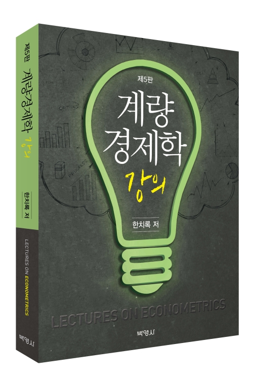

# 계량경제학 강의

[한치록][home](2024), 계량경제학 강의 제5판, [박영사][pybook].



자료:
```r
install.packages('loedata')
```

[오타수정](errata.md)

[목차](Table%20of%20Contents.md)

[강의자료][pybook]

[19장 머신러닝 예제](ml)

[Python 코드](python)

## 제5판 서문

이 책에서 사용된 데이터를 `loedata`라는 R 패키지로 정리하여 [CRAN][loedata]에
등록하였다. 독자들은 이제 간단히
`install.packages("loedata")`로써 데이터 패키지를 설치할 수
있다. [파이썬(python) 코드](python)와 [19장 머신러닝 예제][mlex]는 이 책의 웹페이지에
제공하고 앞으로 지속적으로 업데이트하고자 한다.

제5판에서는 이전 판본의 오타를 수정하고 논의를 명료화한 이외에도,
3.9절에 R제곱과 관련된 유의사항을 추가하였다. 실질적으로 똑같은 결론을
주는 모형일지라도 R제곱은 크게 다를 수 있으므로, 독자들은 R제곱에
지나친 의미를 부여하지 않기 바란다. 11.5절에는 로그 변환과 관련하여
역쌍곡사인(arcsinh 또는 asinh) 함수에 관한 기본적인 논의를 추가하였고,
14장에서는 클러스터 표준오차 구현 시 `sandwich` 패키지를
사용하도록 수정하였다.

제5판이 나오기까지 도움을 준 독자 여러분, 학생들, 동료교수들, 그리고
출판사 관계자들께 깊은 감사를 드린다. 이 책을 통해 독자들이
계량경제학을 좀 더 쉽게 이해하고 활용하게 된다면 저자로서 더 큰 기쁨은
없을 것이다.

2024년 2월<br />
한치록

[home]: https://chan079.github.io
[pybook]: https://www.pybook.co.kr/mall/book/field?goodsno=2198
[loedata]: https://cran.r-project.org/package=loedata
[mlex]: http://econ.korea.ac.kr/~chirokhan/book/mlex/
