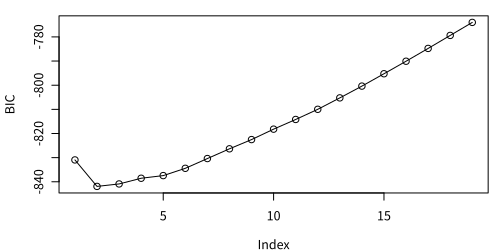
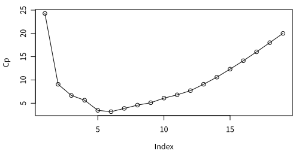
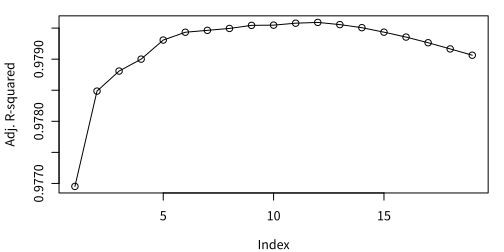

데이터는 <a href="10-data.md">여기</a>를 참조하거나 다음 명령 실행.

```R
rm(list=ls(all=TRUE))
load(url("https://github.com/chan079/loebook/raw/main/ml/1-Regression/data.RData"))
```

## 전체 변수를 사용한 OLS

학습용 데이터 셋(`z14`)의 전체 변수들을 예측변수로 사용하여 OLS 추정을
한 결과는 다음과 같다.

```R
## OLS
ols <- lm(ynext~., data = z14)
summary(ols)$r.sq
# [1] 0.9808557
RMSE(z15$ynext, predict(ols, z15))
# [1] 49.60315
rmspe.rw
# [1] 53.24273
```

회귀의 R제곱은 0.981로 매우 높고, 시험용 자료(`z15`)에 대한 예측
정확도(RMSE로 측정하며, 작을수록 정확함) 면에서 단순 임의보행 예측
RMSE (53.24273)보다 더 낫다(RMSE = 49.60315).

## 변수 선택(subset selection)

이제 예측변수 부분집합을 선택하는 방법들([subset selection])을
살펴본다. 먼저 BIC에 의한 선택을 살펴보고, 교차검증(CV)은 코딩이 약간 복잡하므로
마지막에 살펴본다.

### Best Subset Selection

Best Subset Selection은 [leaps] 패키지에 구현되어 있다. `regsubsets`
명령이 각 $k$에 해당하는 '대표선수'를 선발하도록 회귀를 실행한다.

```R
## Best Subset Selection
library(leaps)
reg.full <- regsubsets(ynext~., data=z14, nvmax=19)
```

'대표선수' 모형 중 [BIC]가 가장 작은 모형을 최적으로 간주하고 선택해
보자. 대표선수 모형 각각에 대하여 BIC 등 수치를 구하려면
`summary(reg.full)` 명령을 사용하면 된다. BIC는 그 결과 중 `$bic`에
보관되어 있다. 다음 명령을 보라.

```R
reg.summ <- summary(reg.full)
plot(reg.summ$bic, type='o', ylab = 'BIC')
(k.best <- which.min(reg.summ$bic))
# [1] 2
```



그림에서도 $k=2$가 최적임을 확인할 수 있다. BIC를 최소화하는 $k$
(`k.best`)에 해당하는 계수 추정값들은 다음과 같다.

```R
coef(reg.full, k.best)
# (Intercept)        aged   deathrate
#  -4.8587439   9.2829695   0.8152651
```

선택된 변수는 `aged`(고령인구비율)와 `deathrate`(2014년 사망률)임을 알
수 있다.

이 두 변수를 사용한 모형이 훈련 데이터(train set)를 맞추는
정도(R제곱)은 다음과 같다.

```R
reg.summ$rsq[k.best]
# [1] 0.9786799
```

전체 변수를 사용할 때(OLS R제곱 0.9809264)만은 못하지만, 직전 연도
사망률과 고령인구비율 2변수만으로도 학습용 데이터에 대하여 매우 높은
설명력(R제곱 0.9786799)을 제공한다.

이 모형선택 결과를 이용하여 test set (2015년 데이터)의 목표변수를
예측하는 방법으로는, 중복 작업이기는 하나 `lm`을 이용하여 다시 회귀한
후 예측하거나, 아니면 `reg.full`로부터 $k=2$에 해당하는 계수를
추출하여 $X\hat\beta$ 공식에 맞추어 계산하는 법이 있다. 첫 번째
방법은 중복 작업이므로, 불편하지만 `regsubsets`에 의하여 이미 추정된 계수들을 사용하여
예측을 하고자 한다. 이 예측은 이 실습에서 반복적으로 등장할
것이므로 다음 함수를 만들어 사용하겠다.

```R
predict.regsubsets <- function(x, newdata, id) {
  bhat <- coef(x, id)
  if (is.data.frame(newdata)) newdata <- model.matrix(eval(x$call[[2]]), newdata)
  as.numeric(newdata[, names(bhat), drop = FALSE] %*% bhat)
}
```

이제 `k.best`를 결정한 후 곧바로 `predict(reg.full, z15, k.best)`처럼
사용할 수 있다.

```R
RMSE(z15$ynext, predict(reg.full, z15, k.best))
# [1] 48.98381
```

위 코드가 맞는지 확인하기 위해서 `ynext`를 `aged`와 `deathrate`에
대하여 다시 OLS 회귀를 하고 그 결과를 이용하여 예측하면 똑같은 결과를 얻는다.

```R
reg <- lm(ynext~aged+deathrate, data=z14)
RMSE(z15$ynext, predict(reg, z15))
# [1] 48.98381
```

이상에서는 BIC를 이용하여 최적 변수를 선택하였다. [Mallows's Cp]를
사용할 수도 있는데, 그러면 $k=5$가 선택되고, 이 경우 test set에 적용한 결과는 다음과 같다.

```R
plot(reg.summ$cp, type='o', ylab = 'Cp')
```



```R
(k.cp <- which.min(reg.summ$cp))
# [1] 6
RMSE(z15$ynext, predict(reg.full, z15, k.cp))
# [1] 46.46588
```

Adjusted R-squared를 비교하면 다음과 같다.

```R
plot(reg.summ$adjr2, type='o', ylab = 'Adj. R-squared')
```



```R
(k.adjr2 <- which.max(reg.summ$adjr2))  # Maximize adjusted R-squared
# [1] 12
RMSE(z15$ynext, predict(reg.full, z15, k.adjr2))
# [1] 49.58692
```

### Forward Stepwise Selection

[Greedy]한 Forward Stepwise Selection을 하려면 앞의 `regsubsets`에
`method = 'forward'`라는 옵션을 주면 된다. 그 나머지는
동일하다. 실제로 실행해 보면, 이 예에서는 선택된 모형이 똑같다(다른
예에서는 안 그럴 수도 있다).

```R
## Forward Stepwise Selection
reg.full.fwd <- regsubsets(ynext~., data=z14, nvmax=19, method='forward')
reg.summ.fwd <- summary(reg.full.fwd)
coef(reg.full.fwd, which.min(reg.summ.fwd$bic))
# (Intercept)        aged   deathrate
#  -4.8587439   9.2829695   0.8152651
```

### Backward Stepwise Selection

[Greedy]한 Backward Stepwise Selection을 하려면 앞의 `regsubsets`에
`method = 'backward'`라는 옵션을 주면 된다. 그 나머지는
동일하다. 실제로 실행해 보면, 이 예에서는 선택된 모형이 똑같다(다른
예에서는 안 그럴 수도 있다).

```R
## Backward Stepwise Selection
reg.full.bwd <- regsubsets(ynext~., data=z14, nvmax=19, method='backward')
reg.summ.bwd <- summary(reg.full.bwd)
coef(reg.full.bwd, which.min(reg.summ.bwd$bic))
# (Intercept)        aged   deathrate
#  -4.8587439   9.2829695   0.8152651
```

참고로, $k=2$인 경우에는 best subset selection, forward stepwise
selection, backward stepwise selection에서 선택된 모형들이
동일하였다. $k=3$에서는 그렇지 않다.

```R
## Compare Best SS, Forward SS, Backward SS
coef(reg.full, 3)
# (Intercept)       smoke        aged   deathrate
# -65.9705911   2.7054220   9.9856840   0.7939802
coef(reg.full.fwd, 3)
# (Intercept)       smoke        aged   deathrate
# -65.9705911   2.7054220   9.9856840   0.7939802
coef(reg.full.bwd, 3)
# (Intercept)        aged   deathrate      tfrate
# -25.0105463  10.0206393   0.7927852  18.0995346
```

$k=3$에서 Best SS = Forward SS ≠ Backward SS 이다.

## Cross Validation을 이용한 변수 개수 결정

이제 10-fold [CV]를 이용하는 것을 실습해 본다. Best Subset Selection으로
실습할 것이다. 먼저 전체 학습용 데이터의 관측치들을 10개로 나눈다.

```R
## Cross Validation
set.seed(1)
group <- sample(1:10, nrow(z14), replace = TRUE)
```

1~10 그룹별 표본크기는 다음과 같다.

```R
table(group)
# group
#  1  2  3  4  5  6  7  8  9 10
# 21 17 22 21 23 24 22 21 28 24
```

다음으로 CV error들을 저장할 공간을 마련한다. 전체 변수 개수가
19개(`dim(z14)`)에서 열 개수 20개 중 목표변수를 제외한 나머지
19개)이므로 19x10 행렬을 만들어 주자. $k$행은 변수 개수, $j$열은
$j$번째 그룹을 validation set으로 사용할 때의 SSR을 저장한다.

```R
kmax <- 19
nfolds <- 10
cv.err <- matrix(NA, kmax, nfolds)  # k = 1..19, fold = 1..10
head(cv.err)
#      [,1] [,2] [,3] [,4] [,5] [,6] [,7] [,8] [,9] [,10]
# [1,]   NA   NA   NA   NA   NA   NA   NA   NA   NA    NA
# [2,]   NA   NA   NA   NA   NA   NA   NA   NA   NA    NA
# [3,]   NA   NA   NA   NA   NA   NA   NA   NA   NA    NA
# [4,]   NA   NA   NA   NA   NA   NA   NA   NA   NA    NA
# [5,]   NA   NA   NA   NA   NA   NA   NA   NA   NA    NA
# [6,]   NA   NA   NA   NA   NA   NA   NA   NA   NA    NA
```

이제 10-fold CV error를 실제로 구하자. $j$그룹 관측치들을 제외하고
모형을 추정한 후, 그 중 $k$개 변수를 사용한 추정 결과를 $j$그룹
관측치들에 적용한 예측오차 제곱합을 위에서 만든 `cv.err` 행렬의
$(k,j)$ 원소로 저장한다.

```R
for (j in 1:nfolds) {  # 10-fold CV
  regs <- regsubsets(ynext~., data=z14[group != j, ], nvmax=19)  # change for forward/backward SS
  xval <- model.matrix(ynext~., data=z14[group == j, ])
  yval <- z14$ynext[group == j]
  for (k in 1:kmax) {  # number of selected variables
    yhat <- predict(regs, xval, k)
    cv.err[k,j] <- sum((yval - yhat)^2)
  }
}
```

이제 각 행별로(즉, 각 변수 개수 $k$별로) 10개 CV error들을 합산하고
이것이 가장 작은 $k$를 선택하면 된다.

```R
(k.cv.best <- which.min(rowSums(cv.err)))
# [1] 2
```

$k=2$에서 CV 오차가 가장 작다. 다음 그림으로부터 이를 재확인할 수 있다.

```R
plot(rowSums(cv.err), type='o')
```


$k=2$를 결정하였으므로 이제 **전체 학습용 데이터를 사용**하여 $k=2$에
해당하는 모형을 회귀하고 그 회귀결과를 이용하여 예측을 한다. 계수
추정값들과 test set 적용 시 RMSE는 다음과 같다.

```R
regs <- regsubsets(ynext~., data=z14, nvmax = k.cv.best)
coef(regs, k.cv.best)
# (Intercept)        aged   deathrate
#  -4.8587439   9.2829695   0.8152651
RMSE(z15$ynext, predict(regs, z15, k.cv.best))
# [1] 48.98381
```

수학적으로 보면 우변에 상수항만 있는 null 모형도 고려하여야 할 것이나, 실질적으로는
무의미하므로 고려하지 않고자 한다.

[leaps]: https://cran.r-project.org/package=leaps
[subset selection]: https://en.wikipedia.org/wiki/Feature_selection#Subset_selection
[greedy]: https://en.wikipedia.org/wiki/Greedy_algorithm
[BIC]: https://en.wikipedia.org/wiki/Bayesian_information_criterion
[Mallows's Cp]: https://en.wikipedia.org/wiki/Mallows%27s_Cp
[CV]: https://en.wikipedia.org/wiki/Cross-validation_(statistics)
