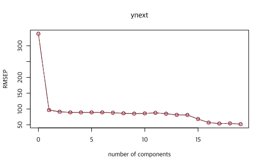
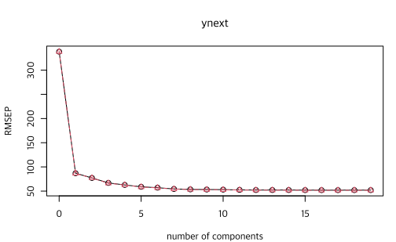

데이터는 <a href="10-data.md">여기</a>를 참조하거나 다음 명령 실행.

```R
rm(list=ls(all=TRUE))
load(url("https://github.com/chan079/loebook/raw/main/ml/1-Regression/data.RData"))
```

# PCR과 PLS

## Principal Components Regression (PCR)

10-fold [CV]로 [PCR]에서 최적 주성분 개수를 결정해 보자.

```R
library(pls)
set.seed(1)
pcreg <- pcr(ynext~., data=z14, scale = TRUE, validation = "CV") # segments=10 (default)
RMSEP(pcreg)
#        (Intercept)  1 comps  2 comps  3 comps  4 comps  5 comps  6 comps
# CV           338.1    96.81    91.31    89.25    89.13    89.21    89.27
# adjCV        338.1    95.45    90.59    88.89    88.80    88.88    89.02
#        7 comps  8 comps  9 comps  10 comps  11 comps  12 comps  13 comps
# CV       88.11    86.39    85.44     86.02     87.87     85.17     81.46
# adjCV    87.91    85.93    84.97     85.79     87.91     84.66     81.01
#        14 comps  15 comps  16 comps  17 comps  18 comps  19 comps
# CV        81.12     68.31     56.95     53.95     54.40     52.00
# adjCV     80.83     67.96     56.64     53.67     54.24     51.71
validationplot(pcreg, type='o')
```



PCR에서 예측변수들의 주성분을 구하는 과정은 비지도학습([unsupervised
learning])이므로 피예측변수에 대한 설명력이 신속히 개선되지는 않을
수도 있음에 유의하라. CV 에러가 가장 작은 것은 19개 성분을 모두
사용하는 경우(`19 comps`)로서, 이는 [전체 변수를 사용한
OLS](11-subset-selection.md)와 동일하다.

그런데 CV 기준을 보면 `ncomp=17`까지 예측오차 정도가 감소한 후 `ncomp=18`에서 살짝 증가하고 `ncomp=19`에서 다시 감소한다. `ncomp=17`을 선택하면 test set에서 예측 성과는
다음과 같다(아래 코드에서 `X15`는 [데이터 준비](10-data.md)에서
생성되었으며 2015년 test set 우변변수들의 행렬임).

```R
RMSE(z15$ynext, predict(pcreg, X15, ncomp=17))
# [1] 47.17808
```

## Partial Least Squares (PLS)

[PLS]는 특성변수들의 선형결합 시 목표변수에 대한 설명력을 고려하므로
CV 오차가 PCR의 경우보다 훨씬 빨리 하락한다.

```R
set.seed(1)
plsreg <- plsr(ynext~., data=z14, scale = TRUE, validation = 'CV')
RMSEP(plsreg)
#        (Intercept)  1 comps  2 comps  3 comps  4 comps  5 comps  6 comps
# CV           338.1    86.95    77.19    66.91    62.76    58.90    57.09
# adjCV        338.1    86.45    77.07    66.26    62.61    58.44    56.72
#        7 comps  8 comps  9 comps  10 comps  11 comps  12 comps  13 comps
# CV       54.42    53.56    53.27     53.04     52.49     52.20     52.23
# adjCV    54.16    53.32    53.01     52.77     52.25     51.92     51.95
#        14 comps  15 comps  16 comps  17 comps  18 comps  19 comps
# CV        52.19     52.02     51.97     51.95     52.01     52.00
# adjCV     51.90     51.71     51.67     51.66     51.71     51.71
validationplot(plsreg, type='o')
```



그림을 보면 PCR에 비하여 PLS의 CV 오차가 확실히 빨리 감소하는 것을
확인할 수 있다. 이는 PCR에서 주성분들을 구하는 방법이 목표변수와 아무
상관 없는 ‘비지도학습’인 반면 PLS는 목표변수를 고려하는 ‘지도학습’이기
때문이다.

위 PLS에서 CV error 기준으로 가장 작은 예측오차를 보이는 것은
`ncomp=17`이다. 이것을 사용하면 test set에서 RMSE는 다음과 같다.

```R
RMSE(z15$ynext, predict(plsreg, X15, ncomp=17))
# [1] 49.59746
```

[CV]: https://en.wikipedia.org/wiki/Cross-validation_(statistics)
[PCR]: https://en.wikipedia.org/wiki/Principal_component_regression
[PLS]: https://en.wikipedia.org/wiki/Partial_least_squares_regression
