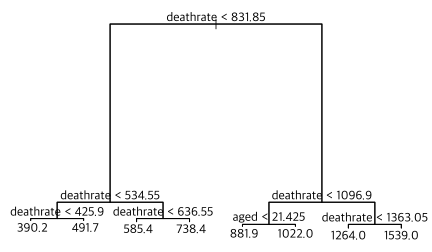
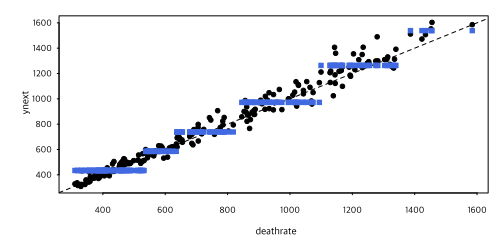

데이터는 <a href="10-data.md">여기</a>를 참조하거나 다음 명령 실행.

```R
rm(list=ls(all=TRUE))
load(url("https://github.com/chan079/loebook/raw/main/ml/1-Regression/data.RData"))
```

## Regression Tree

Regression [tree]를 실습해 보자. Decision tree는 각 구간(잎)마다 하나의
값만을 주므로(piecewise-constant) 경사선을 그리는 여타 회귀모형에
비하여 설명력이나 예측력이 떨어질 수 있음을 염두에 두기 바란다.

### 큰 나무

나무를 만들자. 우선 큰 나무를 만들어 본다. 아래 명령에서 `mindev=.005`
옵션(`mindev`의 디폴트 값은 0.01)은 잔 가지가 많은 나무를 만들도록 해
준다. `mindev` 값이 작을수록 나무를 크게 만든다.

```R
library(tree)
regtr <- tree(ynext~., data=z14, control=tree.control(nrow(z14), mindev=.005)) # large tree
plot(regtr)
text(regtr, pretty = 0)
```



그림을 보면 나뭇잎은 8개이다(`mindev`를 0.001로 하면 만들어지는 나뭇잎
개수는 13개가 된다). 7개 나뭇가지 분기점을 살펴보면, 6개 분기점의
변수가 `deathrate`이고 `aged`가 한 번 등장한다.

### 가지치기

만들어진 나무(`regtr`)를 그대로 사용하지 않고 CV를 통하여 가지치기를
해 주자. 이를 위해 우선 CV (10-fold)를 한다.

```R
set.seed(1)
cv.tr <- cv.tree(regtr, FUN = prune.tree) # K = 10
plot(cv.tr)
```


그림을 보면 잎(말단 노드)이 6개 이상이면 모두 동일한 `$dev` 값을
갖는다. 잎 6개 나무를 최적 나무로 하자.

```R
tr.pruned <- prune.tree(regtr, best=6)
plot(tr.pruned)
text(tr.pruned, pretty = 0)
```


가지치기가 완료된 나무 그림을 보면 나뭇가지 분기의 기준 변수는
`deathrate`뿐임을 알 수 있다. 결국 이 나무로부터 얻은 결과는 1변수
비선형 회귀 모형의 추정 결과이다. 그것도 각 구간마다 수평선을 그리는
piecewise constant 회귀이므로, 설명력이나 예측 성능이 좋으리라
기대하기는 어렵다. 어쨌든 이 가지치기된 나무(`tr.pruned`)를 test set인
`z15` 자료에 적용하여 2016년 사망률을 예측하고, 성능을 살펴보자.

```R
RMSE(z15$ynext, predict(tr.pruned, z15))
# [1] 82.36623
rmspe.rw
# [1] 53.24273
```

예상한 대로 좋지 않다. 한 그루의 나무는 목표변수가 연속변수일 때(즉
회귀 문제에서) 예측 성과가 안 좋기 십상이다. (반면 여러 나무들을
평균내는 [Ensemble](16-tree-ensembles.md) 방법은 평균내는 과정에서 기울기
비슷한 선들이 만들어지므로 대체로 성능이 더 좋다.)

학습용 자료(`z14`)에 해당하는 그림을 그려보면 왜 안 좋은지 알 수
있다. 나무가 piecewise constant이다 보니, 주어진 “X”
변수(`deathrate`)에서 “Y” 변수(`ynext`)를 예측할 때 전반적인 수준은
훌륭하게 따라감에 반하여 세부사항을 무시한다.

```R
fit14 <- predict(tr.pruned, z14)
plot(ynext~deathrate, data=z14)
abline(0,1,lty=2)
points(z14$deathrate, fit14, pch=15, col='RoyalBlue')
```



그러다 보니 학습용 자료(`z14`)에서조차 45도 선(임의보행 예측)보다 더
못한 결과를 만들어 낸다.

```R
RMSE(z14$ynext, fit14)  # pruned tree
# [1] 71.22396
RMSE(z14$ynext, z14$deathrate)  # Random Walk
# [1] 57.12526
```

이 문제는 [bagging](16-tree-ensembles.md)과 [random forest](16-tree-ensembles.md)에서 상당 부분 해결된다.

[tree]: https://en.wikipedia.org/wiki/Decision_tree_learning
