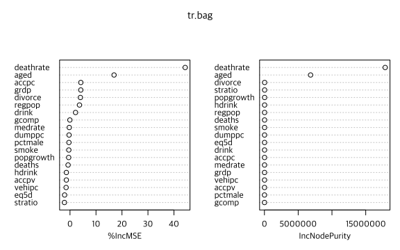
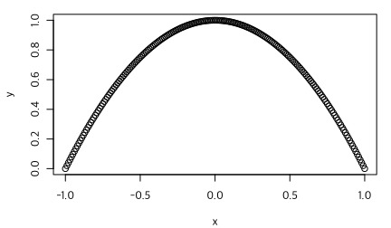
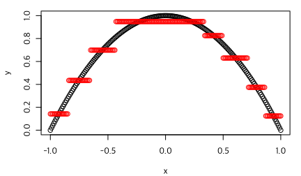
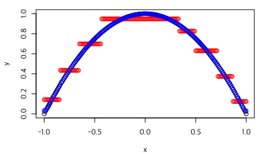
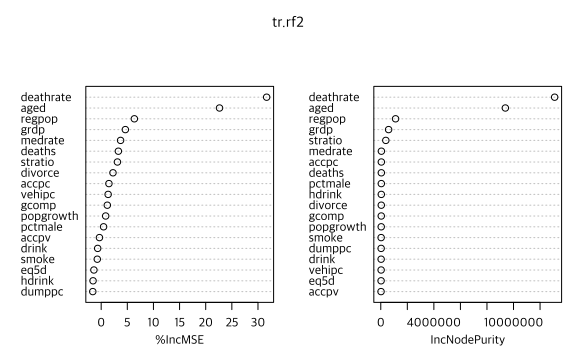
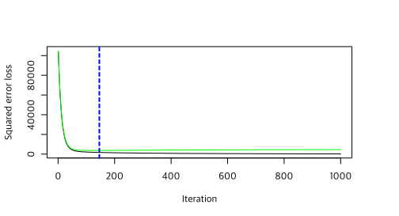
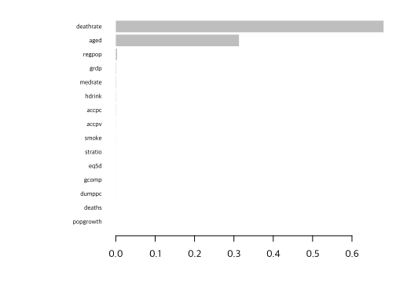
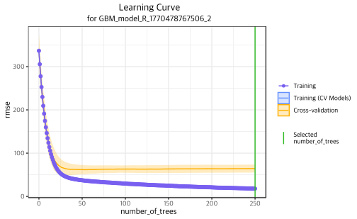
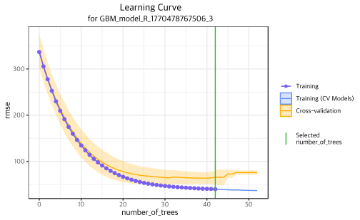

데이터는 <a href="10-data.md">여기</a>를 참조하거나 다음 명령 실행.

```R
rm(list=ls(all=TRUE))
load(url("https://github.com/chan079/loebook/raw/main/ml/1-Regression/data.RData"))
```

[Tree]와 관련된 [Bagging], [Random Forest], [Boosting] 방법을 실습해 본다.

## Tree Bagging

[randomForest][randomForest-pkg] 패키지를 사용하여 나무 [bagging]을 할
수 있다. 최대로 사용할 변수 개수(`mtry`)를 전체 예측변수 개수로
설정하면 된다. 아래에서 학습용 데이터(`z14`)를 이용하여 500회
부트스트랩을 한 나무 bagging을 실행하고 그 결과를 test set (`z15`)에
적용하여 예측성능을 구한다.

```R
## Tree bag
library(randomForest)
dim(z14)  # p = ncol(dataset) - 1
# [1] 223  20
set.seed(1)
tr.bag <- randomForest(ynext~., data=z14, mtry=19, importance=TRUE) # mtry=19 for treebag; 500 trees
RMSE(z15$ynext, predict(tr.bag, z15)) # bagging
# [1] 52.28714
rmspe.rw
# [1] 53.24273
```

Test set에서 RMSE는 52.28714로, 앞의 가지치기된 [나무 한
그루](15-tree.md)(RMSE = 71.22396)에 비하여 큰 개선이 이루어진 것을
볼 수 있다. [Lasso](13-ridge-lasso.md) (RMSE = 47.82)보다는 못하지만
임의보행 결과(53.24273)보다는 낫다. 변수 중요도는 다음과 같다.

```R
importance(tr.bag)
#              %IncMSE IncNodePurity
# popgrowth -1.9202927      26707.19
# eq5d      -0.8643056      18637.14
# drink     -0.1678988      17255.20
# hdrink    -2.7152782      24795.60
# smoke     -0.0299227      19007.98
# aged      18.4896150    7825000.00
# divorce    1.3240276      32165.36
# medrate    1.0195872      17116.51
# vehipc    -0.2568773      16076.83
# accpv      0.6016087      13182.29
# dumppc    -1.1603052      17857.50
# stratio   -1.6214547      27089.90
# deathrate 40.9015505   16822535.86
# cbrate     1.7799114      14516.19
# tfrate     2.5731176      15831.60
# pctmale    0.5416199      16738.71
# accpc      0.4822489      17557.93
# lngrdppc   1.9733756      32287.49
# lnpop      4.2053159      31470.85
```

위에 2가지 '변수 중요도' 척도가 제시되어 있다. `%IncMSE` 열은 각
부트스트랩 표본에서 [OOB] (out of bag) 표본(부트스트랩 시 제외된
관측치들의 표본)의 다른 예측변수들은 그대로 두고 한 예측변수값만을
무작위로 뒤섞을 때 MSE가 증가하는 정도(모든 나무들에서 평균냄)를
증가분들의 표준편차로 나눈 값(표준편차가 0이면 나누지 않는데 이
경우에는 평균도 거의 늘 0임)이며, `IncNodePurity`는 나무에서 각
변수로써 분할이 이루어질 때 SSE가 감소하는 정도의 합계를 모든 나무들에
대하여 평균낸 값이다. 이상의 내용은 <span style="white-space:
nowrap;">[R 도움말][1]</span>과 [Jake Hoarse의 블로그][2]를
참조하였다.

[1]: https://www.rdocumentation.org/packages/randomForest/topics/importance
[2]: https://www.displayr.com/how-is-variable-importance-calculated-for-a-random-forest/

위에 보고된 결과에 의하면 변수들 중 `deathrate`와 `aged` 변수의
중요도가 가장 높게 나온다. 다음과 같이 하여 그림을 그릴 수도
있다(그림은 별로 멋이 없다).

```R
varImpPlot(tr.bag)
```



이상의 bagging에서는 튜닝 매개변수를 선택하지 않았다. 부트스트랩 나무
개수($B$)는 많다고 하여 overfit이 되지 않으므로 튜닝 대상이
아니다. 가지치기도 하지 않았다. 매번 가지치기(pruning)를 한다면
가지치기 정도가 튜닝 대상이 되고, [CV]나 [OOB]를 이용하여 튜닝
매개변수를 결정할 수 있을 것이다.

참고로, `randomForest` 명령에서는 학습용 자료에 대한 설명력 지표를
제공한다. 부트스트랩 표본마다 SSR을 표본크기로 나눈 값(MSE)과 이로부터
구한 ‘R제곱 비슷한 지표’(pseudo R-squared)를 제공한다. $B$회
부트스트랩으로부터 구한 이 ‘R제곱 비슷한 지표’는 다음과 같다. 학습자료
설명력은 매우 높음을 확인할 수 있다.

```R
mean(tr.bag$rsq)
# [1] 0.9722569
```

[randomForest][randomForest-pkg] 패키지는 회귀의 경우 OOB 오차를
제공하지 않는 것 같다.  OOB에 대해서는 나중에 [분류(classification)
나무 앙상블](../2-Classification/26-tree-ensembles.md) 부분에서 살펴본다.

### Bagging의 효과

나무 한 그루와 달리 bagging을 하면 연속변수도 꽤 잘 맞추는 경향이
있다. 다음 예가 bagging의 효과를 극단적으로 보여 준다. 데이터를 다음과
같이 생성해 보자.

```R
## Toy (quadratic function)
smpl <- data.frame(x=seq(-1,1,by=.01))
smpl$y <- 1-smpl$x^2  # y = 1-x^2
plot(y~x, data=smpl)
```



위 그림에 정확한 $y=1-x^2$ 관계가 보인다. 특성변수는 1개(`x`)이다.

나무는 piecewise-constant이므로 나무를 학습하는 것은 토막난 수평선을
그리는 것과 같다. 위 그림에서 토막난 수평선들을 그려 `y`를 맞추기는
쉽지 않아 보인다. 실제로 위 데이터에 대하여 하나의 tree로 학습하고
학습 데이터 예측치를 그려 보면 다음과 같다.

```R
library(tree)
tr <- tree(y~x, data=smpl)  # one tree
points(smpl$x, predict(tr, smpl), col='red')
```



앞서 말한 것처럼 tree는 piecewise constant이므로 여기저기 끊긴 수평선
모양의 점들이 보인다(빨간 색). 수평선들은 실제 y값의 형태를 대략적으로
따라가기는 하지만 제대로 맞추었다고 보기는 힘들다(조각 개수를 아주
많게 하면, 즉 나무 크기를 아주 크게 하면 더 잘 맞출 수는 있을 것이다).

Bagging을 하는 것은 토막난 수평선들을 여러 차례 그린 다음 각 x값마다
여러 수평선들 높이의 평균을 구하는 것과 같다. 많은 수평선들을 평균내면
곡선도 만들 수 있다. 실제 bagging으로 위 데이터를 학습하고 예측하면
다음 파란색과 같이 곡선을 잘 맞춘다(아래에서 예측변수는 1개이므로
`mtry`는 설정할 필요가 없다).

```R
set.seed(1)
trbag <- randomForest(y~x, data=smpl, ntree = 1000)  # tree bag
points(smpl$x, predict(trbag, smpl), col='blue')
```



파란색 점들을 보면 tree bag의 효과를 확인할 수 있다. 단일 tree는
piecewise constant여서 제대로 맞추지 못하나 1000개 tree를 평균냄으로써
부드러운 곡선을 잘 맞추었다.


## 임의의 숲(Random Forest)

[Bagging]과 [Random Forest]의 차이는 나무를 만들 때 변수들을 모두
사용하느냐 아니면 고려할 변수들의 개수(`mtry`)를 제한하느냐이다.

우선 회귀나무 기본 $m$값인 $p/3$의 정수값을 사용한 임의의 숲 결과는
다음과 같다.

```R
## Random Forest
set.seed(1)
tr.rf <- randomForest(ynext~., data=z14)
tr.rf
# 
# Call:
#  randomForest(formula = ynext ~ ., data = z14, importance = TRUE) 
#                Type of random forest: regression
#                      Number of trees: 500
# No. of variables tried at each split: 6
#
#           Mean of squared residuals: 3715.939
#                     % Var explained: 96.72
```

부트스트랩 표본 개수는 500개, 나뭇가지 분기 시 고려한 변수
개수(`mtry`)는 6개(19/3=6.333)이며, 이는 위 결과에도 표시되어 있다. 이
결과를 이용한 test set 예측 성능은 다음과 같다.

```R
RMSE(z15$ynext, predict(tr.rf, z15, type="response"))
# [1] 50.78013
```

[나무 한 그루](15-tree.md)보다는 훨씬 낫고 앞의 [Tree Bagging]보다도
약간 더 낫다.

OOB 관측치들을 이용하여 `mtry`를 CV할 수 있다. 이하에 나오는 `X`와
`Y`는 '[데이터 준비](10-data.md)' 부분에서 만들었으므로 혹시 아래
코드가 작동하지 않으면 해당 페이지를 방문하여 '클립보드로 복사' 버튼을
클릭한 후 R 콘솔에 붙여넣어 실행하고 나서 이 페이지로 돌아오기 바란다.

```R
set.seed(1)
tuneRF(X,Y, ntreeTry = 500, stepFactor = 2, improve=.005) # X,Y: 데이터 준비 page
# mtry = 6  OOB error = 3708.214 
# Searching left ...
# mtry = 3 	OOB error = 6063.54 
# -0.6351645 0.005 
# Searching right ...
# mtry = 12 	OOB error = 3020.347 
# 0.1854981 0.005 
# mtry = 19 	OOB error = 3174.927 
# -0.0511793 0.005 
#    mtry OOBError
# 3     3 6063.540
# 6     6 3708.214
# 12   12 3020.347
# 19   19 3174.927
```


OOB 관측치들을 이용하여 예측능력을 평가했을 때 `mtry=12`가 좋은 것으로
나타났으므로, 이를 이용하여 다시 임의의 숲 학습을 하자.

```R
set.seed(1)
tr.rf2 <- randomForest(ynext~., data=z14, mtry=12, importance=TRUE)  # mtry=12
```

변수 중요도는 다음과 같다.

```R
varImpPlot(tr.rf2)
```



위 학습 결과를 test set에 적용하면 예측 성과는 다음과 같다.

```R
RMSE(z15$ynext, predict(tr.rf2, z15, type="response"))
# [1] 49.65055
```

`mtry`를 아예 CV할 수도 있다. 이하 코드에서는 10-fold CV로 `mtry`를
튜닝한다. 시간이 걸리겠지만 `mtry`를 3−19에 대하여 CV로 탐색하고자
한다. CPU 코어가 여럿인 경우 병렬(parallel) 처리하면 더 빨리 할 수
있으므로 `foreach` 패키지와 `doParallel` 패키지를 이용해서 CV를 병렬로
진행하고자 한다. 우선 10-fold CV를 위한 그룹 구분을 해 준다.

```R
set.seed(1)
group <- sample(1:10, nrow(z14), replace = TRUE)
table(group)
# group
#  1  2  3  4  5  6  7  8  9 10 
# 21 17 22 21 23 24 22 21 28 24 
```

다음으로 병렬처리를 위한 함수를 만들고자 한다. 이 함수는 train set과
validation set을 입력 받아, 3−19까지의 `mtry` 값을 이용하여 train
set에 대하여 임의의 숲 훈련을 하고 각 결과를 validation set에 적용한
예측치를 구하여 리턴해 준다. 행은 validation set에 대응하고 열은
`mtry` 값에 해당한다.

```R
RFpredFun <- function(DF.train, DF.valid) {
  ans <- matrix(NA, nrow(DF.valid), 2) # do nothing for mtry=1,2
  rownames(ans) <- rownames(DF.valid)
  for (i in 3:19) { # mtry = 3, ..., 19
    set.seed(1)
    rf <- randomForest(ynext~., data=DF.train, mtry=i)
    ans <- cbind(ans, predict(rf, DF.valid))
  }
  ans  # Nx19
}
```

위 `RFpredFun` 함수를 `RFpredFun(DF1,DF2)`와 같이 사용하면 `DF1`
데이터셋을 이용하여 `mtry`를 3−19로 설정하여 임의의 숲 훈련을 하고 그
결과를 `DF2` 데이터셋에 적용하여 구한 예측치들의 행렬(행은 `DF2`의 행,
열은 1−19, 단 1−2는 `NA`로 설정)을 리턴한다.

이제 1−10 fold 각각에 대하여 병렬 처리를 하자.

```R
library(foreach)
library(doParallel)

## Prepare for parallel processing
(cores <- detectCores())
# [1] 8
cl <- makeCluster(cores[1]-1, outfile="")
registerDoParallel(cl)

## Parallel training and validation
cvrf <- foreach(fold = 1:10, .combine = rbind, .packages = 'randomForest') %dopar% {
  cat('Work for fold', fold, '\n')
  RFpredFun(z14[group!=fold,], z14[group==fold, ])
}

## Clean up
stopCluster(cl) # Don't forget this!
```

병렬(parallel) 처리를 해도 시간이 좀 걸릴 것이다. 순차(sequential)
처리 시 (CPU 코어가 많은 컴퓨터에서는) 이보다 훨씬 오랜 시간이 걸릴
것이다. 코딩의 명료함을 위해 시간을 희생할 각오가 되어 있다면 `cvrf`를
만드는 코드 전체를 다음과 같이 하여 순차적으로 처리해도 된다. 단,
시간이 꽤 오래 걸려 상당히 답답할 것이다.

```R
cvrf <- NULL
for (fold in 1:10) {
  cat('Work for fold', fold, '\n')
  cvrf <- rbind(cvrf, RFpredFun(z14[group!=fold,], z14[group==fold,]))
}
```

결과는 앞에서 병렬처리로부터 얻은 것과 동일할 것이다.

위 코딩 결과 그룹 1−10 순서로 행들이 정렬되어(즉, 행들이 뒤섞여서)
원래 `z14` 데이터셋의 `ynext` 변수와 그대로 비교할 수 없으므로 행을
`z14`와 동일하도록 재정리해 주자. 이런 부분을 빠뜨리면 이해하기 어려운
결과가 나올 것이다.

```R
cvrf <- cvrf[rownames(z14), ] # Important!
```

마지막으로 각 열(`mtry` 값에 해당)별로 RMSE를 구하고 비교하자.

```R
rmse <- apply(cvrf, 2, function(x) RMSE(x, z14$ynext))
rmse
#  [1]       NA       NA 75.83599 68.69237 64.05685 61.12784 58.74429 57.29122
#  [9] 56.37807 55.60709 55.77512 55.27465 54.89790 55.57927 55.32026 54.64461
# [17] 55.22011 55.74380 56.00762
plot(rmse, type='o', ylab = 'RMSE from 10-fold CV')
which.min(rmse)
# [1] 16
```


이렇게 탐색을 하니까 12가 아니라 `mtry=16`이 최적인 것으로 결정되었다.

## Gradient Boosting

[gbm3][gbm3-pkg] 패키지를 이용하여 [gradient boosting]을 하고자
한다. [James, Witten, Hastie and Tibshirani (2013)][book]을
참고하였다. 3가지 튜닝 매개변수가 있다. 하나는 나무를 업데이트하는
횟수 즉 반복 횟수(`n.trees`, 기본값은 100), 다른 하나는 나무 개선 시
반영하는 정도(`shrinkage`, 기본값은 0.1), 나머지 하나는 나무당 최대
나뭇가지의 개수(`interaction.depth`, 기본값은 1)이다. 일단 이
매개변수들을 (내키는 대로) 특정 값으로 설정한 gradient boosting을 해
보자.

```R
## Gradient boosting
# install.packages('remote')
# remotes::install_github('gbm-developers/gbm3')
library(gbm3)
set.seed(1)
boost <- gbm(ynext~., data=z14, distribution='gaussian', n.trees=1000, interaction.depth=4, shrinkage=0.05)
summary(boost)
#                 var     rel_inf
# deathrate deathrate 62.11925204
# aged           aged 31.52863094
# lnpop         lnpop  1.02304795
# stratio     stratio  0.64037789
# medrate     medrate  0.54826844
# cbrate       cbrate  0.52643133
# drink         drink  0.41833350
# popgrowth popgrowth  0.40240541
# tfrate       tfrate  0.38532525
# smoke         smoke  0.37556831
# hdrink       hdrink  0.34954368
# dumppc       dumppc  0.27757972
# accpv         accpv  0.27402715
# pctmale     pctmale  0.25865945
# lngrdppc   lngrdppc  0.22380130
# accpc         accpc  0.20940941
# eq5d           eq5d  0.20821882
# vehipc       vehipc  0.13608037
# divorce     divorce  0.09503904
RMSE(z15$ynext, predict(boost, z15, n.trees=1000))
# [1] 57.38945
```

Random Forest에서와는 달리 Boosting에서는 반복할수록 training set의
설명력이 좋아진다. 이는 결국 overfit 문제가 발생함을 의미하므로 좋아만
할 일은 아니다. 나무 개선 횟수에 따라 training set의 error를 (로그
스케일로) 그려 보면 다음과 같다.

```R
plot(boost$train.error, type='l', log='y')
```


`predict`에서 몇 번 boosting을 한 것을 이용하여 예측할지
옵션(`n.trees`)을 줄 수 있다. 기본값은 `gbm`에서 설정한 `n.trees`값과
동일하다.

이제 CV로써 최적 `n.tree` 값을 결정하자.  이를 위해서는 `cv.fold`
옵션을 주면 된다.

```R
set.seed(1)
cv1 <- gbm(ynext~., data=z14, distribution='gaussian', n.trees=1000,
           interaction.depth=4, shrinkage=0.05, cv.folds=10)
(k <- gbm.perf(cv1))
# Using cv method...
# [1] 113
cv1$cv_error[k]  # square error loss
# [1] 3884.541
```

위에서는 10-fold CV로써 `n.fold`를 정한다. 실행 결과에 의하면 96회
boost한 결과에서 CV 오차가 최소화되고, 그 CV 오차는 3753.727이다.
Training set에서의 잔차와 CV 예측오차를 그림으로 표현해 보면 CV의
의미를 잘 이해할 수 있다. (참고로, `gbm.perf(cv1)`라고 해도 그림을
얻지만, 로그 스케일로 그리기 위해서 별도 작업을 하였다.)

```R
options(scipen = 100)
plot(cv1$train.error, type='l', log='y')  # CV error
lines(cv1$cv_error, lty=2)  # train error
abline(v=k, lty=3)
legend('topright', c('Training error', 'CV error'), lty=1:2)
```


Train error는 boosting을 반복할수록 점점 줄어들지만 CV error는 일정
횟수 이상이 되면 오히려 증가한다. Overfitting의 전형적인 모습이며,
나중에 살펴볼 [인공신경망](18-nn.md)에서도 이와 유사한 일이
발생한다.

86회(세로 점선) boost한 결과를 이용한 test set에서의 예측 성과는
개선된 바가 없다.

```R
RMSE(z15$ynext, predict(cv1, z15, n.trees=k))
# [1] 56.76636
```

위에서는 `shrinkage`를 0.05로 설정하였다. 이 값이 작은 것은 개선의
단계들을 더 '촘촘하게' 훑고 지나간다는 뜻이다. 이 `shrinkage`를 0.1로
증가시키면 training error가 더 빨리 감소하고 최적 횟수는 더 작을
것이다.

```R
set.seed(1)
cv2 <- gbm(ynext~., data=z14, distribution='gaussian', n.trees=1000,
           interaction.depth=4, shrinkage=0.1, cv.folds=10)
(k <- gbm.perf(cv2, plot=FALSE))
# Using cv method...
# [1] 47
cv2$cv_error[k]
# [1] 4007.547
```

최적 횟수(42번) boost한 CV 오차는 4152.718로서 `shrink`가 0.05일
때(`cv1` 참조)보다 더 나쁘다.

`shrinkage`를 0.001로 감소시키면 결과는 다음과 같다. 0.001이 아주 작은
값이어서 업데이트가 천천히 일어나므로 `n.trees`를 10000으로
설정하였다. 시간이 더 오래 걸릴 것이다.

```R
set.seed(1)
cv3 <- gbm(ynext~., data=z14, distribution='gaussian', n.trees=10000,
           interaction.depth=4, shrinkage=0.001, cv.folds=10)
(k <- gbm.perf(cv3, plot=FALSE))
# [1] 5107
cv3$cv_error[k]
# [1] 3768.519
```

이 결과의 최적 CV 오차 정도는 3768.519로서 `shrinkage = 0.05`인
경우(`cv1`)보다 약간 작다. (`set.seed`의 값을 다르게 하면 다른 결과를 얻을
것으로 예상된다.)

`shrinkage`를 0.05로 설정하고 `interaction.depth`를 2로 낮추면 결과는
다음과 같다.

```R
set.seed(1)
cv4 <- gbm(ynext~., data=z14, distribution='gaussian', n.trees=1000,
           interaction.depth=2, shrinkage=0.05, cv.folds=10)
(k <- gbm.perf(cv4, plot=FALSE))
# [1] 146
cv4$cv_error[k]
# [1] 3700.452
```

`interaction.depth`가 4인 경우보다 CV 오차가 근소하게 더 낮다. 위의
`cv4`를 이용하여 `k`번(즉, 146번) 업데이트한 결과를 가지고 test set에
대하여 예측한 후 RMSE를 구하면 결과는 다음과 같다.

```R
RMSE(z15$ynext, predict(cv4, z15, n.trees=k))
# [1] 55.09341
```

근소하게 개선되었으나 그리 인상적이지는 않다. 여기서도
`gbm.perf(cv4)`라고 하면 training error와 CV error 그림을 얻을 수
있다. 검정색은 training error, 녹색은 CV error, 파란색 세로 파선은
최적 반복횟수이다.

```R
gbm.perf(cv4)
# [1] 146
```



참고로, `gbm` 패키지는 나무를 개선하면서 모든 관측치들을 사용하는 것이
아니라 임의로 추출된 100$p$% 관측치만을 사용한다. 여기서 $p$는
`bag.fraction` 옵션으로써 설정할 수 있고, 기본값은 0.5이다. `gbm`
명령에서 `bag.fraction=1` 옵션을 주면 나무 개선 단계에서 모든
관측치들을 사용한다. 이 `bag.fraction`도 튜닝 대상으로 삼을 수
있다(여기서는 해 보지 않겠다).

이하에서는 `interaction.depth`를 1−4로 하고 `shrinkage`를 0.01, 0.05, 0.1, 0.2 중
하나로 하는 모든 가능한 셋팅에 대하여 “grid search”를 해 본다. 단,
`bag.fraction`은 1로 설정한다.

```R
param <- expand.grid(depth=1:4, shrinkage=c(.01, .05, .1, .2))
param
#    depth shrinkage
# 1      1      0.01
# 2      2      0.01
# 3      3      0.01
# 4      4      0.01
# 5      1      0.05
# 6      2      0.05
# 7      3      0.05
# 8      4      0.05
# 9      1      0.10
# 10     2      0.10
# 11     3      0.10
# 12     4      0.10
# 13     1      0.20
# 14     2      0.20
# 15     3      0.20
# 16     4      0.20
```

위 16개 셋팅 각각에 대하여 최적 boosting 횟수를 CV로 결정하고 이 최적
횟수에서 얻어지는 CV 예측오차 정도를 비교하자. CPU 코어가 많은 경우
parallel processing을 하면 상당한 시간 절약이 가능하다.

```R
## Prepare parallel processing
cores <- detectCores()
cl <- makeCluster(cores[1]-1, outfile="")
registerDoParallel(cl)

## Do parallel processing
gbmcv <- foreach(i = 1:nrow(param), .combine = rbind, .packages = 'gbm') %dopar% {
  set.seed(1)
  cv <- gbm(ynext~., data=z14, distribution='gaussian', n.trees = 1000,
            interaction.depth = param$depth[i],
            shrinkage = param$shrinkage[i], cv.folds=10, bag.fraction = 1)
  k <- gbm.perf(cv, plot = FALSE)
  cat('Setting', i, 'done\n')
  c(unlist(param[i,]), best.iter = k, cv.error = cv$cv.error[k])
}

## Clean up
stopCluster(cl) # Don't forget this
```

결과를 보면 다음과 같다.

```R
gbmcv <- as.data.frame(gbmcv)
gbmcv
#           depth shrinkage best.iter cv.error
# result.1      1      0.01       998 3630.006
# result.2      2      0.01       582 3720.937
# result.3      3      0.01       490 3729.329
# result.4      4      0.01       535 3726.609
# result.5      1      0.05       229 3615.427
# result.6      2      0.05       123 3755.437
# result.7      3      0.05        98 3695.825
# result.8      4      0.05       106 3711.570
# result.9      1      0.10       102 3733.403
# result.10     2      0.10        57 3818.618
# result.11     3      0.10        43 3692.883
# result.12     4      0.10        45 3750.950
# result.13     1      0.20        56 3678.420
# result.14     2      0.20        31 3749.144
# result.15     3      0.20        23 3696.403
# result.16     4      0.20        22 3839.775
```

CV 오차도가 가장 낮은 셋팅은 다음과 같다.

```R
(opt <- gbmcv[which.min(gbmcv$cv.error),])
#          depth shrinkage best.iter cv.error
# result.5     1      0.05       229 3615.427
```

위 결과에 의하면 `interaction.depth`는 1, `shrinkage`는 0.05인
경우이며, 이때 최적 개선(boosting) 횟수는 229이다. 이를 이용하여 test
set에 대한 예측을 하면 결과는 다음과 같다.

```R
#set.seed(1)  # unnecessary with bag.fraction = 1
gb <- gbm(ynext~., data=z14, distribution = 'gaussian', n.trees = opt$best.iter,
          interaction.depth = opt$depth, shrinkage = opt$shrinkage, bag.fraction = 1)
RMSE(z15$ynext, predict(gb, z15, n.trees = opt$best.iter, type = 'response'))
# [1] 52.51224
```

약간 개선이 되기는 했는데, 여기서 서술하지 않은 여러 실험 결과들에
의하면 이는 `bag.fraction`을 1로 설정했기 때문인 것 같다.

## 요약

필자의 경험에 의하면 [gradient boosting]은 train set의 학습에
엄청난 성과를 보이고, 그 결과 overfitting 문제가 쉽게 발생한다. 그래서
boosting 횟수(`gbm` 명령의 `n.trees` 매개변수) 튜닝이
핵심적이다(아래의 [xgboost][xgboost-pkg] 패키지는 `nrounds`, `h2o`
패키지는 `ntrees`). 반면 [random forest]는 튜닝 매개변수에 덜 민감하여
사용자 입장에서 더 편안한 마음으로 사용할 수 있다. 각자 장단점이
있으며, 사용자는 유행에 휩쓸리기보다는 이것저것 다 해 보는 것이 좋다.

## Extreme Gradient Boosting (XGBoost)

Gradient Boosting을 여러 면에서 개선하고, overfitting을 막기 위한
regularization을 도입한 것으로 Extreme Gradient Boosting
([XGBoost][xgboost-paper])이 있다. XGBoost는 R에
[xgboost][xgboost-pkg] 패키지로 구현되어 있다. [Ian Johnson의
2020/11/29 블로그][IJ]를 참고하였다. 실습할 데이터는 앞에서와
같다(필요하면 [여기](10-data.md) 방문).

[IJ]: https://www.r-bloggers.com/2020/11/r-xgboost-regression/

`xgboost`의 튜닝 매개변수로 부스팅 횟수(`nrounds`), 나무의 maximum
depth (`max_depth`, 기본값은 6), 개선속도(`eta`, 기본값은 0.3)가
있다. 그 외에도 `gamma`, `min_child_weight`, `subsample` 등
매개변수가 있으나 처음 3개 매개변수로 CV 대상을 제한한다.

우선 주어진 `max_depth=4`와 `eta=.05`에 대하여 최적 반복횟수를 찾아
보자. 최적 반복횟수를 찾을 때, 앞에서 `gbm` 패키지를 사용할 때에는
`n.trees`를 1000으로 설정하고, 가장 작은 CV error를 주는 반복횟수를
선택하였다. 이보다 약간 간편한 방법으로 CV error가 일정 단계 동안
개선되지 않으면 boosting을 중단하는 방법(**early stopping**)도 있다.
그렇게 하면 시간이 훨씬 단축된다. 다음 명령에서는 최대 1,000회
boosting을 반복하지만 5회(`early_stopping_rounds`) 이상 CV error의
개선이 이루어지지 않으면 중단(early stopping)하도록 설정한다. 참고로,
`early_stopping_rounds` 값이 크면 stopping이 일어나기 더 어려우므로
최적 반복횟수가 더 커진다. 단, 최적 반복횟수는 난수의 시드만 바꾸어도
상당히 달라질 수 있으므로 결과에 예민하게 반응할 것은 없다.

```R
## Extreme Gradient Boosting
library(xgboost)
set.seed(1)
xgbcv <- xgb.cv(
    param = xgb.params(max_depth=6, eta=0.05),
    data=xgb.DMatrix(X, label=Y),
    nfold=10, nrounds=1000, early_stopping_rounds=5
)
xgbcv$early_stop$best_iteration
# [1] 133
xgbcv$evaluation_log$test_rmse_mean[xgbcv$early_stop$best_iteration]
# [1] 60.14897
with(xgbcv$evaluation_log, plot(iter, train_rmse_mean, type='l'))
with(xgbcv$evaluation_log, lines(iter, test_rmse_mean, lty=2))
abline(v=xgbcv$early_stop$best_iteration, lty=3)
```


위 그림에서 실선은 training error, 파선은 CV error, 세로 점선은 'best
iteration'인 145회에 해당한다.

최적 반복횟수(145회)를 구하였으므로 다시 Gradient Boosting을 하고,
test set에서 예측 성과를 확인하자.

```R
xgb <- xgboost(X, Y, nrounds=xgbcv$early_stop$best_iteration, max_depth=6, learning_rate=.05)
RMSE(z15$ynext, predict(xgb, X15))
# [1] 61.46164
```

결과가 그리 좋지는 않다([xgboost][xgboost-pkg] 패키지가 안 좋다는 뜻이
아니다).

이제 여러 `max_depth`와 `nrounds` 값들을 CV로 비교해 보자. 각각의
주어진 매개변수 셋팅에서 `nrounds`는 early stopping으로 찾는다. 고려할
매개변수 값들은 다음과 같다.

```R
param <- expand.grid(max_depth = 2:6, eta = c(.01, .05, .1, .2))
param
#    max_depth  eta
# 1          2 0.01
# 2          3 0.01
# 3          4 0.01
# 4          5 0.01
# 5          6 0.01
# 6          2 0.05
# 7          3 0.05
# 8          4 0.05
# 9          5 0.05
# 10         6 0.05
# 11         2 0.10
# 12         3 0.10
# 13         4 0.10
# 14         5 0.10
# 15         6 0.10
# 16         2 0.20
# 17         3 0.20
# 18         4 0.20
# 19         5 0.20
# 20         6 0.20
```

위 20가지 매개변수 셋팅에 대하여 최적 CV 오차 RMSE를 구하자('최적'은
`nrounds`를 최적으로 선택한다는 뜻).

```R
## Prepare parallel processing
cores <- detectCores()
cl <- makeCluster(cores[1]-1, outfile="")
registerDoParallel(cl)

## Do parallel processing
xgbcv.full <- foreach(i = 1:nrow(param), .combine = rbind, .packages = 'xgboost') %dopar% {
  set.seed(1)
  cv <- xgb.cv(
      data=xgb.DMatrix(X, label=Y), nfold=10, nrounds=5000, early_stopping_rounds=5,
      param = xgb.params(max_depth=param$max_depth[i], eta=param$eta[i]),
      verbose = F
  )
  best.iter <- cv$early_stop$best_iteration
  cv.error <- cv$evaluation_log$test_rmse_mean[best.iter]
  cat('Setting', i, 'done\n')
  c(unlist(param[i,]), best.iter = best.iter, cv.error = cv.error)
}

## Clean up
stopCluster(cl) # Don't forget this

xgbcv.full <- as.data.frame(xgbcv.full) # not necessary but convenient
xgbcv.full
#           max_depth  eta best.iter cv.error
# result.1          2 0.01       492 57.11302
# result.2          3 0.01       471 58.25906
# result.3          4 0.01       440 60.20988
# result.4          5 0.01       453 60.67408
# result.5          6 0.01       480 60.61594
# result.6          2 0.05       100 56.80632
# result.7          3 0.05        91 57.95773
# result.8          4 0.05        78 60.84517
# result.9          5 0.05       113 59.92145
# result.10         6 0.05       133 60.14897
# result.11         2 0.10        42 57.14876
# result.12         3 0.10        42 57.95161
# result.13         4 0.10        38 60.41400
# result.14         5 0.10        52 60.76555
# result.15         6 0.10        72 60.47089
# result.16         2 0.20        29 56.54282
# result.17         3 0.20        24 57.39540
# result.18         4 0.20        21 59.08269
# result.19         5 0.20        21 62.93482
# result.20         6 0.20        35 61.50288
```

최적 CV 오차 RMSE가 가장 작은 매개변수 셋팅은 다음과 같다.

```R
(opt <- xgbcv.full[which.min(xgbcv.full$cv.error),])
#           max_depth eta best.iter cv.error
# result.16         2 0.2        29 56.54282
```

이 셋팅을 이용하여 Gradient Boosting 하고 예측하면 다음과 같다.

```R
xgb <- xgboost(X, Y, nrounds = opt$best.iter, max_depth = opt$max_depth, learning_rate = opt$eta)
RMSE(z15$ynext, predict(xgb, X15))
# [1] 52.9766
```

‘체면’은 차렸다. 변수 중요도는 다음과 같이 시각화해 볼 수 있다.

```R
xgb.plot.importance(xgb.importance(model = xgb))
```



참고로, `xgboost`에서도 나무를 개선할 때 일부만 사용하도록 할 수 있다.
`subsample` 옵션을 사용하는데, 기본값은 1이다. 만약 `subsample`을 0.5
등으로 바꾸면 `xgboost`를 실행할 때마다 결과가 달라지므로 결과를
재연할 수 있도록 하려면 `set.seed(1)` 등으로 통제해야 할 것이다.

### H2O 패키지를 이용한 Tree 앙상블

[앞에서](13-ridge-lasso.md#h2o.lasso) 소개한 [h2o]
패키지([설치][h2o-inst])를 이용하여 tree 앙상블을 구현해 보자. 이
패키지는 데이터셋 크기가 클 때 특히 유용할 것으로 추측한다. `h2o`
패키지는 통일된 인터페이스를 제공하므로 한 번 익숙해지면 그 다음부터는
편리하다. 앞에서 [lasso를 H2O로 구현해 본 바
있다](13-ridge-lasso.md#h2o.lasso).

먼저 `h2o`를 초기화하고 데이터셋과 변수명들을 준비한다.

```R
## H2O package
library(h2o)
h2o.init()  # does lots of things
z14h <- as.h2o(z14)  # training set
z15h <- as.h2o(z15)  # test set
yvar <- 'ynext'
xvar <- setdiff(names(z14), yvar)  # character vector
```

**Random Forest** 학습을 해 보자. Boosting과 달리 부트스트랩은
반복횟수(`ntrees`)가 많아도 overfit 문제를 야기하지 않으므로 `ntrees`
매개변수와 관련된 CV를 하지 않는다. 그냥 큰 값을 주면 된다. CV는
`max_depth`나 `mtries` 매개변수를 대상으로 grid search 방식으로 할 수
있다. 전부 기본값을 준 상태에서 `ntrees = 500`으로 설정하여 학습을
하고 변수 중요도를 그림으로 그리면 다음과 같다.

```R
rf.h2o <- h2o.randomForest(xvar, yvar, z14h, ntrees = 500, seed = 1)
h2o.varimp_plot(rf.h2o)  # only first 10 (give option to view more)
```


위에서 변수 중요도는 10개 변수까지만 그렸다. 변수 개수를 바꾸고 싶으면
`h2o.varimp_plot(rf.h2o, 19)`처럼 옵션을 주면 된다.

OOB training sample들의 RMSE는 `rf.h2o`라고 하면 바로 화면에 표시할 수
있고, `h2o.rmse(rf)`라고 하면 숫자를 구할 수 있다.

```R
rf.h2o
# Model Details:
# ==============
# 
# H2ORegressionModel: drf
# Model ID:  DRF_model_R_1770480045723_1 
# Model Summary: 
#   number_of_trees number_of_internal_trees model_size_in_bytes min_depth
# 1             500                      500              913248        10
#   max_depth mean_depth min_leaves max_leaves mean_leaves
# 1        17   13.18200        122        161   140.78600
# 
# 
# H2ORegressionMetrics: drf
# ** Reported on training data. **
# ** Metrics reported on Out-Of-Bag training samples **
# 
# MSE:  3517.533
# RMSE:  59.3088
# MAE:  42.15535
# RMSLE:  0.06999919
# Mean Residual Deviance :  3517.533

h2o.rmse(rf.h2o)  # OOB
# [1] 59.3088
```

Test set에 학습 결과를 적용하여 예측 성능을 구하면 다음과 같다.

```R
h2o.performance(rf.h2o, newdata = z15h)
# H2ORegressionMetrics: drf
# 
# MSE:  2606.404
# RMSE:  51.05295
# MAE:  36.15251
# RMSLE:  0.06786916
# Mean Residual Deviance :  2606.404
```

RMSE는 51.05295로서 앞에서 `randomForest` 패키지를 활용한 경우와
유사하다. 참고로, `mtries`를 12로 설정하면 결과는 다음과 같다.

```R
rf2.h2o <- h2o.randomForest(xvar, yvar, z14h, ntrees = 500, mtries = 12, seed = 1)
# h2o.performance(rf2.h2o, newdata = z15h)
# H2ORegressionMetrics: drf
# 
# MSE:  2553.612
# RMSE:  50.53328
# MAE:  36.19486
# RMSLE:  0.06119575
# Mean Residual Deviance :  2553.612
```

Random number가 발생되는 방식이 달라서 `randomForest` 패키지의
경우와 근소하게 다르다.

**Gradient Boosting**을 하려면 `h2o.gbm` 명령을 사용한다. Boosting은
boost할수록 학습성과가 좋아지므로 `ntrees`가 너무 크면 overfitting
문제가 발생한다. `ntrees`가 중요한 튜닝 매개변수이므로 잘 선택해
주어야 한다. 한 가지 방법은 다음과 같이 CV로써 찾는 것이다.

```R
b0.h2o <- h2o.gbm(xvar, yvar, z14h, nfolds = 10, ntrees = 250, score_each_iteration = TRUE,
                  max_depth = 2, learn_rate = 0.1, seed = 1)
h2o.learning_curve_plot(b0.h2o)
```



이렇게 하기는 했으나 CV error를 가장 작게 해 주는 반복횟수는 별도로
구해야 한다. 다음이 필자가 찾은 방법인데 더 쉬운 방법이 있는지는 모르겠다.

```R
cv.mse <- sapply(b0.h2o@model$cv_scoring_history, function(x) x$validation_rmse^2)
dim(cv.mse)  # (iter = 0, 1, ..., 250) x (nfolds = 10)
# [1] 251   10
(n <- which.min(rowMeans(cv.mse))-1)
# [1] 56
```

위에서 56개라고 하였으므로 56개 tree를 만드는 Gradient Boosting을
학습하고 test set에 적용하면 다음 결과를 얻는다.

```R
b.h2o <- h2o.gbm(xvar, yvar, z14h, ntrees = n, max_depth = 2, learn_rate = 0.1, seed = 1)
h2o.rmse(b.h2o, train = TRUE)  # train set
# [1] 35.91896
h2o.performance(b.h2o, newdata = z15h)  # test set
# H2ORegressionMetrics: gbm
# 
# MSE:  2680.628
# RMSE:  51.77478
# MAE:  37.67609
# RMSLE:  0.06348479
# Mean Residual Deviance :  2680.628
```

**Early stopping**을 사용할 수도 있다. 아래 명령에서는
`stopping_rounds` 옵션을 '3'으로 주어, boost 시 최근 '3'회 CV 에러들의
단순 이동평균 감소 정도가 '3'회 이상 `stopping_tolerance` (기본값은
0.001)에 미달하면 boosting을 멈추도록 한다(`h2o.gbm` 도움말 참조). 이
방법으로 구한 boosting 횟수(나무 개수)는 40회이다(아래 결과
참조). 참고로, `stopping_rounds`가 클수록, 그리고
`stopping_tolerance`가 클수록 early stopping이 일어나기 어려우므로
결과적으로 선택되는 boosting 횟수(나무 개수)가 많아진다(overfitting
가능성 $\uparrow$).

```R
b2.h2o <- h2o.gbm(
    xvar, yvar, z14h, nfolds = 10, ntrees = 1000, score_each_iteration = TRUE,
    max_depth = 2, learn_rate = 0.1, stopping_rounds = 3, seed = 1
)
b2.h2o@model$model_summary
# Model Summary: 
#   number_of_trees number_of_internal_trees model_size_in_bytes min_depth
# 1              42                       42                4552         2
#   max_depth mean_depth min_leaves max_leaves mean_leaves
# 1         2    2.00000          3          4     3.97619
h2o.learning_curve_plot(b2.h2o)
```



```R
h2o.performance(b2.h2o, newdata = z15h)
# H2ORegressionMetrics: gbm
# 
# MSE:  2664.973
# RMSE:  51.62337
# MAE:  37.39238
# RMSLE:  0.06494159
# Mean Residual Deviance :  2664.973
```

Test set RMSE는 51.62337이다.

위에서는 `max_depth`와 `learn_rate`를 2와 0.1로 설정한 상태에서
10-fold CV에 의하여 최적의 `ntrees` (boosting 횟수, 혹은 나무 개수)를
선택하였다. `max_depth`와 `learn_rate`도 튜닝 매개변수인데, 이 값들을
바꾸어 가면서 각 셋팅에서 최소 CV MSE를 구하고(early stopping 없이
수동으로 CV MSE를 구했다면 최소 CV MSE 사용, early stopping을
사용했다면 `h2o.mse(..., xval = TRUE)` 또는 `h2o.rmse(..., xval =
TRUE)` 사용), 이 최소 CV MSE가 가장 작은 셋팅을 선택하는 grid search도
가능하다.

마지막으로 `h2o`를 종료한다.

```R
h2o.shutdown(prompt = FALSE)
```

[tree]: https://en.wikipedia.org/wiki/Decision_tree_learning
[bagging]: https://en.wikipedia.org/wiki/Bootstrap_aggregating
[random forest]: https://en.wikipedia.org/wiki/Random_forest
[boosting]: https://en.wikipedia.org/wiki/Boosting_%28machine_learning%29
[randomForest-pkg]: https://cran.r-project.org/package=randomForest
[OOB]: https://en.wikipedia.org/wiki/Out-of-bag_error
[CV]: https://en.wikipedia.org/wiki/Cross-validation_(statistics)
[gbm3-pkg]: https://github.com/gbm-developers/gbm3
[gbm-pkg]: https://cran.r-project.org/package=gbm
[gradient boosting]: https://en.wikipedia.org/wiki/Gradient_boosting
[book]: https://www.statlearning.com/
[xgboost-pkg]: https://cran.r-project.org/package=xgboost
[xgboost-paper]: https://www.kdd.org/kdd2016/papers/files/rfp0697-chenAemb.pdf
[h2o]: https://www.h2o.ai/products/h2o/
[h2o-inst]: https://docs.h2o.ai/h2o/latest-stable/h2o-docs/downloading.html
