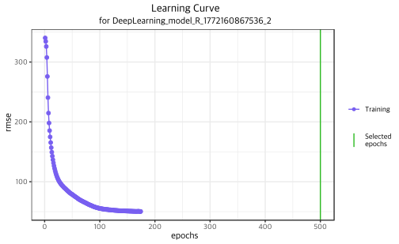
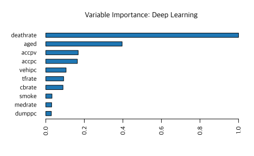

데이터는 <a href="10-data.md">여기</a>를 참조하거나 다음 명령 실행.

```R
rm(list=ls(all=TRUE))
load(url("https://github.com/chan079/loebook/raw/main/ml/1-Regression/data.RData"))
```

## Neural Networks

### H2O 패키지 설치

[Lasso](13-ridge-lasso.md) 부분의 마지막에 살펴본 바 있는 [h2o]
패키지([설치][h2o-inst])를 사용한다. <mark>설치 시 파일 다운로드 도중에
중단되면, `options(timeout = 600)`으로 time-out 시간을 적절히 늘려
주면(600은 10분) 도움이 된다.</mark>

```R
options(timeout=600)
install.packages(
    "h2o", type="source",
    repos=(c("http://h2o-release.s3.amazonaws.com/h2o/latest_stable_R"))
) # will take long
options(timeout=60) # default
```

구버전으로 만족하다면 `install.packages("h2o")`로도 충분하다. 시스템에
[Java]가 설치되어 있어야 한다. 설치가 끝났으면 다음으로 시험해 본다.

```R
library(h2o)
h2o.init()
h2o.shutdown(prompt = FALSE)
```

`library(h2o)` 부분에서 오류가 발생하는 것은 R `h2o` 패키지가 제대로
설치되지 않았음을 의미하고, `h2o.init()` 부분에서 오류가 발생하는 것은
[Java]와 관련되었을 가능성이 높다. 오류 메시지를 읽어 보고 문제를 해결하기 바란다.

H2O는 배경에 java 엔진을 돌리고 R의 `h2o` 패키지는 이 엔진에 접속하여
일처리를 한다. 뭔가 알 수 없는 오류가 발생할 수도 있는데, 그럴 때에는
`h2o.shutdown(prompt = FALSE)`로 H2O를 shutdown한 후 다시 해 보거나,
아니면 시스템을 재부팅해야 할지도 모른다. 가급적 최신 버전을 사용하는
것이 좋겠다.

[Java]: https://www.java.com/

### NN 실습

이 절의 내용은 [H2O.ai의 Deep Learning 문서][h2o-dl]를 참고하였다.
우선 `h2o`를 시작한다.

```R
library(h2o)
h2o.init()
```

H2O에서 자료 집합은 특별한 형태로 관리된다. `as.h2o()` 함수를 사용하여
만들 수 있다. 매번 `as.h2o(z14)`처럼 사용해도 좋으나, 자주 사용할
것이므로 미리 만들어 두고 시작하자.

```R
z14h <- as.h2o(z14)
z15h <- as.h2o(z15)
```

다음으로 [NN]을 학습해 본다. 노드 1개짜리 은닉층이 1개 있는 모형을
학습해 보자(`hidden = c(1)`).

```R
yvar <- 'ynext'
xvar <- setdiff(names(z14), yvar)
nn <- h2o.deeplearning(
    xvar, yvar, z14h, standardize = TRUE, hidden = c(1), epochs = 100,
    seed = 1, reproducible = TRUE
)
h2o.performance(nn, train=TRUE)
# H2ORegressionMetrics: deeplearning
# ** Reported on training data. **
# ** Metrics reported on full training frame **
# 
# MSE:  3075.358
# RMSE:  55.45591
# MAE:  41.94908
# RMSLE:  0.08381859
# Mean Residual Deviance :  3075.358
```

위에서 `reproducible = TRUE` 옵션은 매번 동일한 결과를 얻도록 하기
위함이다. Train set의 RMSE는 55.45591이다. 참고로, 이 RMSE는 다음과 같이
구할 수도 있다.

```R
RMSE(z14h$ynext, h2o.predict(nn, z14h))
# [1] 55.45591
```

Train set에 대하여 학습 없이 Random Walk로부터 구한 RMSE는 다음과 같다.

```R
RMSE(z14$ynext, z14$deathrate)
# [1] 57.12526
```

NN으로부터 얻은 train set의 RMSE (53.03459)는 단순 random walk를 적용한
결과(RMSE = 57.12526)보다는 더 낫다.

위 NN 학습 결과를 test set에 적용할 때 예측 결과는 다음과 같다.

```R
h2o.performance(nn, newdata = z15h)
# H2ORegressionMetrics: deeplearning
# 
# MSE:  2881.438
# RMSE:  53.67903
# MAE:  40.58653
# RMSLE:  0.08181938
# Mean Residual Deviance :  2881.438
```

결과는 평범하다(nn으로부터의 RMSE 53.67903을 random walk의 RMSE 53.24273과
비교). `epochs = 500`으로 설정하면 결과는 다음과 같다.

```R
nn500 <- h2o.deeplearning(
    xvar, yvar, z14h, standardize = TRUE, hidden = c(1), epochs = 500,
    seed = 1, reproducible = T
)
nn500
# Model Details:
# ==============
# 
# H2ORegressionModel: deeplearning
# Model ID:  DeepLearning_model_R_1770594414767_2
# Status of Neuron Layers: predicting ynext, regression, gaussian distribution, Quadratic loss, 22 weights/biases, 5.6 KB, 38,802 training samples, mini-batch size 1
#   layer units      type dropout       l1       l2 mean_rate rate_rms momentum
# 1     1    19     Input  0.00 %       NA       NA        NA       NA       NA
# 2     2     1 Rectifier  0.00 % 0.000000 0.000000  0.001816 0.000680 0.000000
# 3     3     1    Linear      NA 0.000000 0.000000  0.000428 0.000000 0.000000
#   mean_weight weight_rms mean_bias bias_rms
# 1          NA         NA        NA       NA
# 2    0.066276   0.247064  1.710990 0.000000
# 3    0.650682   0.000000 -1.122742 0.000000
# 
# 
# H2ORegressionMetrics: deeplearning
# ** Reported on training data. **
# ** Metrics reported on full training frame **
# 
# MSE:  2527.73
# RMSE:  50.27654
# MAE:  37.07948
# RMSLE:  0.06478088
# Mean Residual Deviance :  2527.73

h2o.performance(nn500, newdata = z15h)
# H2ORegressionMetrics: deeplearning
# 
# MSE:  2385.507
# RMSE:  48.84165
# MAE:  35.29854
# RMSLE:  0.0631815
# Mean Residual Deviance :  2385.507
```

Test set에 대한 예측력이 약간 좋아졌다. 거듭 말하지만 test set
예측력이 좋아졌다는 것은 사후적으로 보니 그렇다는 것이며, test set에
대한 예측력을 바탕으로 모델을 고르는 것은 아니다.

위에서 `epochs`는 [boosting](16-tree-ensembles.md)에서 boosting 횟수의 역할을
하며, 튜닝 대상이다. 아무 옵션도 주지 않으면 `stopping_rounds = 5`
옵션을 준 것과 같아서, 최근 5회 deviance의 단순 이동평균이 5회 이상
개선되지 않으면 자동으로 멈추도록 되어 있다([early stopping]). 실제로,
`epochs = 500`으로 주었지만 172회에서 멈추었다.

```R
max(nn500@model$scoring_history$iterations)
# [1] 174
h2o.learning_curve_plot(nn500)
```



[CV]를 위해서는 `h2o`에서 `nfolds = 10`과 같은 옵션을 주면 CV를
한다. 그러면 `stopping_rounds` epoch 이상 CV 성능개선이 없으면
멈춘다(early stopping). `stopping_rounds`를 50으로 설정하면 결과는
다음과 같다.

```R
nn.tuned <- h2o.deeplearning(
    xvar, yvar, z14h, standardize = TRUE, hidden = c(1), epochs = 1000,
    seed = 1, nfolds = 10, stopping_rounds = 50, variable_importances = TRUE,
    reproducible = TRUE
)
h2o.learning_curve_plot(nn.tuned)
```


위 명령에서 `epochs = 1000`으로 최대 횟수를 1,000으로 설정하였으나
[early stopping] 기준에 따라 약 300회 후 종료되었음을 알 수
있다(`stopping_rounds`를 50으로 설정했는데, 더 작은 숫자로 줄이면 더
일찍 종료된다).

학습의 성능은 다음과 같다.

```R
h2o.performance(nn.tuned, train = TRUE)  # train
# H2ORegressionMetrics: deeplearning
# ** Reported on training data. **
# ** Metrics reported on full training frame **
# 
# MSE:  2261.82
# RMSE:  47.55859
# MAE:  34.05254
# RMSLE:  0.0549978
# Mean Residual Deviance :  2261.82
h2o.performance(nn.tuned, xval = TRUE)   # cross validation
# H2ORegressionMetrics: deeplearning
# ** Reported on cross-validation data. **
# ** 10-fold cross-validation on training data (Metrics computed for combined holdout predictions) **
# 
# MSE:  2711.744
# RMSE:  52.07441
# MAE:  36.94998
# RMSLE:  0.06287353
# Mean Residual Deviance :  2711.744
h2o.performance(nn.tuned, newdata = z15h) # test set
# H2ORegressionMetrics: deeplearning
# 
# MSE:  2284.211
# RMSE:  47.79342
# MAE:  34.04269
# RMSLE:  0.05835265
# Mean Residual Deviance :  2284.211
h2o.varimp_plot(nn.tuned)
```



위 결과에 의하면 `stopping_rounds` 값이 50일 때 train, CV, test RMSE는
각각 47.55859, 52.07441, 47.79342이다.

참고로, CV 및 early stopping과 관련하여 [H2O.ai FAQ][h2o-faq]에 다음과
같이 설명되어 있다.

<blockquote>
**Can H2O automatically feed back the implications of the
cross-validation results to improve the algorithm during training, as
well as tune some of the model’s hyperparamters?**<br />
<br />
Yes, H2O can use cross-validation for parameter tuning if early
stopping is enabled (stopping_rounds>0). In that case,
cross-validation is used to automatically tune the optimal number of
epochs for Deep Learning or the number of trees for DRF/GBM. The main
model will use the mean number of epochs across all cross-validation
models.
</blockquote>

추가로, 은닉층 node 개수를 1, 2, 3개로 하면서 CV RMSE를 비교해 보자.

```R
nn1 <- h2o.deeplearning(
    xvar, yvar, z14h, standardize = TRUE, hidden = c(1), epochs = 1000,
    seed = 1, nfolds = 10, stopping_rounds = 50, reproducible = T
)
h2o.performance(nn1, xval = TRUE)  # CV
# H2ORegressionMetrics: deeplearning
# ** Reported on cross-validation data. **
# ** 10-fold cross-validation on training data (Metrics computed for combined holdout predictions) **
# 
# MSE:  2711.744
# RMSE:  52.07441
# MAE:  36.94998
# RMSLE:  0.06287353
# Mean Residual Deviance :  2711.744
nn2 <- h2o.deeplearning(
    xvar, yvar, z14h, standardize = TRUE, hidden = c(2), epochs = 1000,
    seed = 1, nfolds = 10, stopping_rounds = 50, reproducible = T
)
h2o.performance(nn2, xval = TRUE)  # CV
# H2ORegressionMetrics: deeplearning
# ** Reported on cross-validation data. **
# ** 10-fold cross-validation on training data (Metrics computed for combined holdout predictions) **
# 
# MSE:  3130.099
# RMSE:  55.94729
# MAE:  38.8997
# RMSLE:  0.06275171
# Mean Residual Deviance :  3130.099
nn3 <- h2o.deeplearning(
    xvar, yvar, z14h, standardize = TRUE, hidden = c(3), epochs = 1000,
    seed = 1, nfolds = 10, stopping_rounds = 50, reproducible = T
)
h2o.performance(nn3, xval = TRUE)  # CV
# H2ORegressionMetrics: deeplearning
# ** Reported on cross-validation data. **
# ** 10-fold cross-validation on training data (Metrics computed for combined holdout predictions) **
# 
# MSE:  3481.161
# RMSE:  59.00136
# MAE:  44.83659
# RMSLE:  0.07681666
# Mean Residual Deviance :  3481.161
```

작은 NN의 CV 오차수준이 더 낮다. 그러므로 위에서 은닉층 노드 개수를
1개로 한 모형이 2개나 3개보다 선호된다. (은닉층을 아예 없애면 학습에
시간이 아주 오래 걸리고 성과가 더 나아지지도 않는다.)

본 실습에서는 overfitting보다는 underfitting이 문제인 것 같다.
일반적으로는 overfitting이 문제이다. 이 경우 NN에서 overfitting을
피하는 방법으로 early stopping 이외에도 L1 또는 L2 regularisation
(lasso와 ridge와 유사, `l1`과 `l2` 옵션 사용), Hinton et al (2012)의
[dropout] 방법(`input_dropout_ratio`와 `hidden_dropout_ratios` 옵션
사용)도 사용된다.

다음 명령으로 `h2o`를 종료한다.

```R
h2o.shutdown(prompt = FALSE)
```

[CV]: https://en.wikipedia.org/wiki/Cross-validation_(statistics)
[h2o]: https://www.h2o.ai/products/h2o/
[h2o-inst]: https://docs.h2o.ai/h2o/latest-stable/h2o-docs/downloading.html
[h2o-faq]: https://docs.h2o.ai/h2o/latest-stable/h2o-docs/data-science/gbm-faq/cross_validation.html
[h2o-dl]: https://docs.h2o.ai/h2o/latest-stable/h2o-docs/data-science/deep-learning.html
[NN]: https://en.wikipedia.org/wiki/Neural_network
[dropout]: http://www.cs.toronto.edu/~hinton/absps/dropout.pdf
[early stopping]: https://docs.h2o.ai/h2o/latest-stable/h2o-docs/data-science/early_stopping.html
