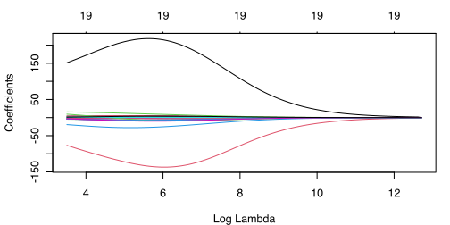
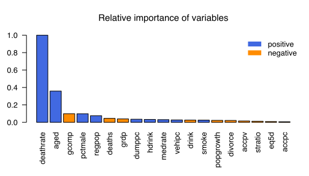

# Ridge와 Lasso

이하에서는 회귀(regression) 문제에서 ridge와 lasso 회귀를
실습한다. `glmnet` 패키지를 사용하는 방법과 [h2o]
패키지([설치][h2o-inst])를 사용하는 방법을 모두 설명한다. 두 패키지 중
`glmnet`이 더 간편하고 안정적인 것으로 보임에도 `h2o` 패키지를
소개하는 것은, `h2o`가 [deep learning]을 제대로 구현하고 있어,
독자들이 일단 여기에 노출되기를 바라기 때문이다.

## Ridge regression

`glmnet` 패키지를 이용하여 [ridge] 회귀를 해 보자.

```R
## Ridge
library(glmnet)
## See (데이터 준비) page for Y, X, and X15
ridge <- glmnet(X,Y,alpha=0)  # alpha=0 for ridge (1=lasso)
plot(ridge, xvar='lambda', sign=1)
```



그림이 특이하다. $\lambda$가 증가함에 따라 보통은 변수들의 계수가
수축되는데 지금은 어떤 변수의 계수가 수축되는 것이 아니라 확장되었다가
수축된다. 매우 특이하며, 필자는 이런 경우를 별로(거의) 보지 못했다.

다음으로 10-fold [CV] 방법으로 최적 $\lambda$를 정한다. 먼저
`cv.glmnet` 명령을 이용하여 CV를 하고 결과를 그림으로 그려 보자.

```R
set.seed(1)
cv.ridge <- cv.glmnet(X,Y, alpha=0)  # 0 = ridge, 1 = lasso
plot(cv.ridge, sign=1)
```


CV를 최소화시키는 $\lambda$ 값은 아래에서 보듯이 33.27139이다. Test
set (`z15`)에 대하여 CV를 이용한 최적 ridge를 적용한 예측의 성과는
앞의 변수선택 방법보다 나쁘며 단순한 random walk와 거의 비슷하다.

```R
(best.lambda <- cv.ridge$lambda.min)
# [1] 33.27139
RMSE(z15$ynext, predict(cv.ridge, newx = X15, s = 'lambda.min'))
## RMSE(z15$ynext, predict(ridge, newx = X15, s = best.lambda)) # same
# [1] 53.99689
rmspe.rw
# [1] 53.24273
```

보통은 ridge의 결과가 좋은데 여기서 이렇게 안 좋은 것은 특이하다. 이는
`lambda`가 제대로 선택되지 않았기 때문으로 보인다. 특히 위 그림에서
CV를 최소화시키는 $\lambda$ (왼쪽 점선)가 후보군 내에 거의 최솟값인 것
같다. 이는 최적 $\lambda$는 그보다 더 작을 수도 있음을 의미한다.
이하에서 이 점을 개선해 보자.

#### Ridge에서 $\lambda$ 선택 개선

위 ridge의 성능이 좋지 않다. 그 이유가 $\lambda$ 선택이 좋지 않기
때문이라는 의심이 든다. `glmnet` 명령이 자동으로 선택한 `lambda` 값
후보들 중 `best.lambda`가 어디쯤인지 살펴보기 위해 후보값들 중 가장
작은 6개를 보았더니 다음과 같았다.

```R
tail(cv.ridge$lambda)
# [1] 52.97746 48.27109 43.98282 40.07551 36.51531 33.27139
```

CV에 의한 최적 $\lambda$값(`cv.ridge$lambda.min`) 33.27139는 이들
$\lambda$ 후보 중 가장 작다. 더 작은 $\lambda$ 값에서는 예측 성능이 더
좋을 수도 있다. 그러니 `glmnet`으로 하여금 더 작은 $\lambda$ 값들도
후보군에 포함시키도록 해야 할 것 같다. 이를 위해 `lambda.min.ratio`를
기본값(0.0001)보다 작은 값(예를 들어 `1e-6`)으로 설정하고, 이와 더불어
$\lambda$ 값들을 더 촘촘히 하기 위해 `nlambda` 옵션(기본값은 100)을
증가시키자. 아래에서는 `nlambda`를 200으로 설정하였다.

```R
set.seed(1)
cv.ridge2 <- cv.glmnet(X,Y,alpha=0, lambda.min.ratio=1e-6, nlambda=200)
cv.ridge2$lambda.min
# [1] 0.8204098
tail(cv.ridge2$lambda)
# [1] 1.0103761 0.9426106 0.8793901 0.8204098 0.7653852 0.7140511
```

선택된 $\lambda$ 값은 전체 200개 중 3번째로 작은 값이어서 여전히
불만스러우나, 어쨌든 가장 작은 값은 아니니 됐다. 이 `lambda` 값을
이용한 test set 예측의 성능은 다음과 같다.

```R
RMSE(z15$ynext, predict(cv.ridge2, X15, s = 'lambda.min'))
# [1] 49.72394
rmspe.rw
# [1] 53.24273
```

이렇게 조정해 주었더니 ridge의 결과가 훨씬 나아졌다. 계수들과 표준화
계수들은 다음과 같다.

```R
bhat.ridge <- coef(cv.ridge2, s = 'lambda.min')
options(scipen=1)  # fixed digits (not exponential notation)
cbind(bhat.ridge, bhat.ridge * c(1, apply(X, 2, sd)))
# 20 x 2 sparse Matrix of class "dgCMatrix"
#                         1           1
# (Intercept) -282.50349431 -282.503494
# grdp          -1.17756612   -9.311269
# regpop        86.84145413   18.055504
# popgrowth     -2.68510803   -5.301252
# eq5d          -2.05815174   -2.097936
# deaths        -0.01410179  -10.733191
# drink         -1.39124153   -6.211952
# hdrink         2.22434327    7.894561
# smoke          2.34114522    6.159724
# aged          10.99928869   85.067698
# divorce      -14.02562562   -5.159043
# medrate        0.80357585    7.268658
# gcomp         -4.54592170  -23.546566
# vehipc        76.94518991    6.547744
# accpv         -1.34752466   -3.625625
# dumppc        21.42175764    8.453333
# stratio       -0.62597700   -2.995986
# deathrate      0.73503960  237.090334
# pctmale       18.81388329   23.451831
# accpc         -1.20022043   -1.563887
```

위에서 첫 번째 칼럼은 계수, 두 번째 칼럼은 표준화 계수이다(상수항은
표준화하지 않음). 단, `glmnet`은 표준화를 위해 표본분산을 구할 때
$n-1$로 나누는 것이 아니라 $n$으로 나누는 반면, R의 `sd` 명령은
$n-1$로 나눈 값에 제곱근을 취하므로, 위의 두 번째 열이 정확한
`glmnet`의 표준화 계수인 것은 아니나, 크기 비교만 할 것이므로 문제
없다. 계수 자체(변수의 측정단위에 따라 규모가 달라짐)가 아니라 표준화
계수값의 크기가 클수록 중요한 변수이다. `deathrate`와 `aged`가 가장
중요한 두 변수이다.

표준화 계수들의 상대적 크기(변수 중요도, 가장 중요한 변수의 중요도를
1.0으로 표준화)를 다음과 같이 그림으로 표현할 수 있다.

```R
plotVarimp <- function(bhat, X, horiz = FALSE) {
  bstd <- bhat[-1,]*apply(X,2,sd)  # standardize, drop intercept
  bstd <- bstd/max(abs(bstd))  # max=1.0
  bstd <- bstd[order(abs(bstd), decreasing = !horiz)]  # sort
  colors <- c('royalblue', 'darkorange')
  par(mar=if (horiz) c(5,6,4,1) else c(6,3,4,1), lend=1)  # need more space for variable names
  barplot(abs(bstd), names=names(bstd), col=colors[1+(bstd<0)], horiz=horiz, las=if (horiz) 1 else 2, main='Relative importance of variables')
  legend(if (horiz) 'bottomright' else 'topright', c('positive','negative'), lty=1, lwd=8, col=colors, bty='n')
}
plotVarimp(bhat.ridge, X)  # try 'horiz = TRUE'
```



## Lasso

[Lasso]를 위해서는 `glmnet`과 `cv.glmnet`에서 `alpha`를 0에서 1로
바꾸면 된다.

```R
lasso <- glmnet(X,Y,alpha=1)
plot(lasso, xvar='lambda')
```


Lasso에 대하여 10-fold [CV]를 하면 결과는 다음과 같다.

```R
set.seed(1)
cv.lasso <- cv.glmnet(X,Y, alpha=1)  # 0 = ridge, 1 = lasso
plot(cv.lasso)
```


이로부터 최적 $\lambda$를 구하고 이에 대응하는 lasso 추정 결과를
test set (`z15`)에 적용하여 사망률을 예측한 성과는 다음과 같다.

```R
(best.lambda <- cv.lasso$lambda.min)
# [1] 4.193873
RMSE(z15$ynext, predict(cv.lasso, X15, s = 'lambda.min'))
# [1] 47.75449
rmspe.rw
# [1] 53.24273
```

테스트셋에서 lasso의 RMSE는 random walk보다 더 낫고 [Best Subset
Selection](index12.php)보다도 더 낫다.

예측오차 제곱합이 최저인 $\lambda$(`lambda.min`)보다는 “one standard
error” (1se)를 사용하는 경우도 많다. 이를 위해서는 `'lambda.min'`
대신에 `'lambda.1se'`를 사용하면 된다.

Ridge와 달리 lasso는 변수선택도 해 준다. Lasso에 의하여 선택된
변수들과 그 계수는 `coef` 명령으로써 확인할 수 있다. 또한, 변수들의
중요도를 표준화 계수(beta coefficient)의 크기, 즉 $X_j$를 표준화한
상태에서의 계수 추정값($\beta_j$에 $X_j$의 표본표준편차를 곱함)의
크기로써 표현할 수 있다.

```R
bhat.lasso <- coef(cv.lasso, s = 'lambda.min')
cbind(bhat.lasso, bhat.lasso * c(1, apply(X, 2, sd)))
# 20 x 2 sparse Matrix of class "dgCMatrix"
#                         1            1
# (Intercept) -21.597694166 -21.59769417
# grdp         -0.378493197  -2.99282738
# regpop        .             .         
# popgrowth    -0.611976373  -1.20823481
# eq5d          .             .         
# deaths        .             .         
# drink         .             .         
# hdrink        0.473597293   1.68087485
# smoke         0.883223640   2.32382574
# aged          9.192892015  71.09715744
# divorce       .             .         
# medrate       0.006258674   0.05661216
# gcomp         .             .         
# vehipc       15.166516844   1.29061308
# accpv         .             .         
# dumppc        .             .         
# stratio       .             .         
# deathrate     0.794543587 256.28361133
# pctmale       .             .         
# accpc         .             .         

plotVarimp(bhat.lasso, X)  # defined above
```


표준화 계수 추정값의 크기에 의하면, 직전연도 사망률(`deathrate`)이
가장 중요하고 그 다음으로 고령인구비율(`aged`)이 중요한
예측변수이다. 여기에 흡연인구 비율(`smoke`), 고위험 음주인구
비율(`hdrink`), 인구증가율(`popgrowth`), 1인당 자동차 수(`vehipc`)가
사망률 예측에 미세한 도움을 준다.

이 예에서, 2015년 시험용 자료에서 그 다음 해 `deathrate` (즉,
`ynext`)의 예측에는 lasso가 ridge보다 더 나은 예측성과를 보였지만,
다른 목표변수나 다른 자료의 경우에는 결과가 달라질 수 있다. Lasso가
변수선택을 해 준다는 사실과 예측을 얼마나 잘하느냐는 별개의
문제이다. 참 모형이 sparse (많은 변수들의 계수가 0)할 경우에는 특정
lasso가 마치 어느 변수의 계수가 0인지 정확히 아는 것과 같다는
성질('오라클'이라 함)이 있다는 결과들도 있으나, 참 모형이 sparse한지
알지 못하므로 실질적으로는 큰 의미가 없다. 그냥, ridge가 더 나은
경우도 있고 lasso가 더 나은 경우도 있다고 이해하는 편이 간편하다. 특정
문제에서 목표변수가 관측되지 않은 상태에서 ridge가 더 나은지 lasso가
더 나은지 알 수는 없다. 하나의 문제에서 lasso가 더 나았다고 하여 다른
문제에서도 그러라는 법은 없다. 그러지 말라는 법도 없다.

## Elastic Net

$\alpha = 0$은 ridge, $\alpha=1$은 lasso이다. [Elastic net]은 일반적인
$\alpha$를 사용하는 방법을 통칭한다. $\alpha=0.5$를 사용하면 결과는
다음과 같다.

```R
set.seed(1)
cv.enet <- cv.glmnet(X,Y,alpha=0.5, lambda.min.ratio=1e-6, nlambda=200)
plot(cv.enet)
RMSE(z15$ynext, predict(cv.enet, X15, s = 'lambda.min'))
# [1] 46.18572
bhat.enet <- coef(cv.enet, s='lambda.min')
plotVarimp(bhat.enet, X)
```


예측 오차가 아주 작은데(RMSE = 46.06922), 이는 우연히 그런 것이다.
$\alpha=0.5$는 체계적인 방법으로 최적화하여 정한 것이 아니라, 한번
시도해 본 것뿐이다. 그 대신 $\alpha$를 CV 방법으로 정할 수도 있다.

### Grid search를 이용한 $\alpha$ 매개변수의 선택

많이 사용되지는 않지만, grid search를 통하여 최적의 $\alpha$
매개변수를 선택하는 것도 가능하다. 각각의 $\alpha$ 값에서 CV를 통하여
$\lambda$를 찾고 이 $\lambda$에 해당하는 CV error를 기록하여 비교하면
된다. 이하에서는 $\alpha = 0, 0.1,\ldots, 0.9, 1$에 대하여 비교하고자
한다.

```R
pset <- data.frame(alpha = seq(0,1,by=.1), lambda.min = NA, cv.err = NA)

set.seed(1)
for (i in 1:nrow(pset)) {
  set.seed(1)  # important for same fold ID for all alpha
  cv1 <- cv.glmnet(X,Y,alpha = pset$alpha[i], lambda.min.ratio = 1e-6, nlambda = 200)
  pset$lambda.min[i] <- cv1$lambda.min
  err <- cv1$cvm[cv1$index['min',1]]
  pset$cv.err[i] <- err
}
pset
#    alpha lambda.min   cv.err
# 1    0.0  0.8204098 2714.922
# 2    0.1  0.8016422 2708.978
# 3    0.2  1.7223300 2689.722
# 4    0.3  1.4140911 2682.232
# 5    0.4  5.6125048 2662.508
# 6    0.5  5.5296669 2642.683
# 7    0.6  4.6080558 2630.376
# 8    0.7  4.2337157 2622.856
# 9    0.8  4.5622807 2617.291
# 10   0.9  4.3469058 2613.710
# 11   1.0  3.9122153 2615.097
which.min(pset$cv.err)
# [1] 10
```

위 결과에 의하면 $\alpha=0.9$일 때 CV error (MSE)가 가장 작고, 이때 최적
$\lambda$는 4.3469058이다. (앞에서 최적 $\alpha$에 해당하는 `cv.glmnet`
결과를 저장해 놓을 수도 있었으나 시간이 얼마 걸리지 않으므로)
$\alpha=0.9$로 다시 한번 elastic net을 실행하면 결과는 다음과 같다.

```R
cv.09 <- cv.glmnet(X, Y, alpha = 0.9, lambda.min.ratio = 1e-6, nlambda = 200)
RMSE(z15$ynext, predict(cv.09, X15, 'lambda.min'))
# [1] 47.30136
```

<a name="h2o.lasso"></a>

## H2O 패키지를 이용한 lasso

[H2O.ai][h2o] (설치는 [여기][h2o-inst])는 `glmnet` 패키지보다 훨씬
무겁지만, 방대한 데이터셋을 처리할 수 있고, 더 다양한 옵션을 제공하며,
특히 나중에 살펴볼 [인공신경망](index19.php) 등을 포함하므로 한번
연습해 보기로 하자. Lasso (alpha = 1)를 고려한다. 다른 elastic net을
이용하려면 alpha를 바꾸면 된다. Grid search로써 alpha를 정할 수도
있으나, 여기서는 1로 설정한다.

H2O는 데이터셋도 나름의 방식으로 처리하여 사용한다. 이를 위해 `as.h2o`
명령(약간 시간이 걸림)으로써 데이터셋을 먼저 처리하여 저장해 두는 것이
간편하다. 아래에서는 `z14h <- as.h2o(z14)` 등처럼 해 두고 `z14h` 등을
사용할 것이다.

```R
## H2O package
library(h2o)
h2o.init()
yvar <- 'ynext'     # name of target variable
xvar <- setdiff(names(z14), yvar) # character vector
z14h <- as.h2o(z14) # h2o's data format
z15h <- as.h2o(z15) # h2o's data format
## lasso with cross validation
glm <- h2o.glm(xvar, yvar, z14h, alpha=1, nfolds=10, lambda_search = TRUE, early_stopping = FALSE, seed=1)
glm@model$lambda_best
# [1] 5.285855
glm@model$coefficients_table
# Coefficients: glm coefficients
#        names coefficients standardized_coefficients
# 1  Intercept    -8.857370                769.412108
# 2       grdp    -0.310505                 -2.455230
# 3     regpop     0.000000                  0.000000
# 4  popgrowth     0.000000                  0.000000
# 5       eq5d     0.000000                  0.000000
# 6     deaths     0.000000                  0.000000
# 7      drink     0.000000                  0.000000
# 8     hdrink     0.279261                  0.991143
# 9      smoke     0.716354                  1.884778
# 10      aged     9.214701                 71.265826
# 11   divorce     0.000000                  0.000000
# 12   medrate     0.000000                  0.000000
# 13     gcomp     0.000000                  0.000000
# 14    vehipc     1.009409                  0.085897
# 15     accpv     0.000000                  0.000000
# 16    dumppc     0.000000                  0.000000
# 17   stratio     0.000000                  0.000000
# 18 deathrate     0.794411                256.240748
# 19   pctmale     0.000000                  0.000000
# 20     accpc     0.000000                  0.000000
## h2o.std_coef_plot(glm)  # xlim bug?
h2o.varimp_plot(glm)
RMSE(z15$ynext, as.vector(h2o.predict(glm, z15h)))
# [1] 47.86051
h2o.shutdown(prompt = FALSE)
```


참고로, `glmnet`과 `h2o`의 변수 표준화 방식에 약간 차이가 있다.
`glmnet`은 표본표준편차를 구할 때 분모를 $n-1$이 아니라 $n$으로 나누는
반면 `h2o`에서는 $n-1$로 나눈다. 또한, `glmnet`의 $\lambda$를 $y$의
표본표준편차로 나누어야 `h2o`의 $\lambda$와 유사한 값이 되는 것으로
보인다. `lambda_min_ratio` (디폴트는 $n>p$이면 0.0001), `nlambdas`,
`solver` 등을 잘 지정할 필요가 있어 보이지만, 특이하게도 일반적인
elastic net에서 `glmnet`처럼 안정적인 결과를 얻기는 매우 어려웠다. 또,
`glmnet` 패키지는 grid search에 사용한 $\lambda$ 값들을 리턴해 주지만
`h2o.glm`은 최적 $\lambda$만 리턴하는 것 같다(필자가 잘 모르는 것일
수도 있다). 데이터셋이 웬만한 크기여서 `glmnet`에서도 잘 돌아가기만
한다면 [Elastic net] ([ridge]와 [lasso] 포함)의 경우 `h2o`보다는
`glmnet` 패키지를 사용하는 것을 추천한다.

[h2o]: https://www.h2o.ai/products/h2o/
[h2o-inst]: https://docs.h2o.ai/h2o/latest-stable/h2o-docs/downloading.html
[h2o-faq]: https://docs.h2o.ai/h2o/latest-stable/h2o-docs/data-science/gbm-faq/cross_validation.html
[h2o-dl]: https://docs.h2o.ai/h2o/latest-stable/h2o-docs/data-science/deep-learning.html
[deep learning]: https://en.wikipedia.org/wiki/Deep_learning
[ridge]: https://en.wikipedia.org/wiki/Ridge_regression
[lasso]: https://en.wikipedia.org/wiki/Lasso_(statistics)
[elastic net]: https://en.wikipedia.org/wiki/Elastic_net_regularization
