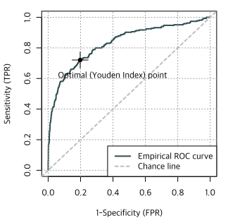
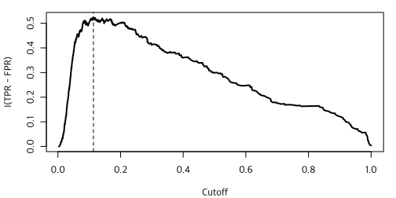
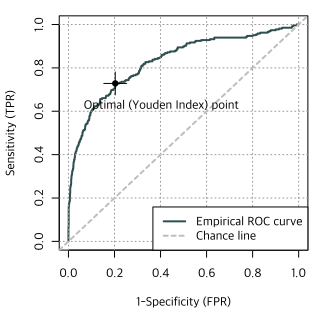
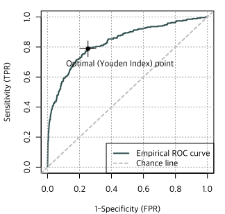

데이터는 <a href="20-data.md">여기</a>를 참조하거나 다음 명령 실행.

```R
rm(list=ls(all=TRUE))
load(url("https://github.com/chan079/loebook/raw/main/ml/2-Classification/data.RData"))
data(Hmda, package="Ecdat")
```

# Receiver Operating Characteristic (ROC) 곡선

로짓 회귀와 같은 분석에서는 `yes`와 `no` 카테고리가 곧바로 예측되는
것이 아니라, 우선 `yes`일 확률을 예측한 후 이로부터 연구자가 예를 들어
확률이 0.5 이상이면 `yes`라고 예측한다는 식으로 규칙을 정하여
적용한다. 확률 0.5라는 경계(cutoff)는 ‘확률이 더 높은 쪽을 고른다’는
뜻을 가지므로 가장 직관적이다. 그렇다고 하여 반드시 0.5를 기준으로
해야만 하는 것은 아니고 0−1 사이의 아무 값이든 경계값으로 삼아도 좋다.

경계(cutoff)값을 0에서 1로 점차 변화시키면서 [TPR][evalbin] (즉,
sensitivity)과 [FPR][evalbin] (즉, 1-specificity)이 어떻게 바뀌는지
그림으로 표현한 것이 [ROC] 곡선이다. [앞 단원(Logistic
Regression)](21-logit.md)의 학습한 ‘전체 데이터를 사용한 로짓모형’에
대해서 ROC 곡선을 그려 보자.

```R
## Full logit
full <- glm(deny~., data = TrainSet, family = binomial)
train.phat.full <- predict(full, TrainSet, type = 'r')
## ROC
library(ROCit)
roc.train.full <- rocit(train.phat.full, TrainSet$deny)
plot(roc.train.full)
```



Cutoff 값을 0으로 한다면(즉, 확률 예측값이 0보다 크면 `yes`라고
예측한다면) 늘 `yes`라고 예측할 것이므로 truth가 `yes`인 경우나 `no`인
경우나 100% `yes`라고 예측한다. 그래서 [TPR][evalbin]과
[FPR][evalbin]이 모두 1이 된다. ROC 곡선에서 이는 우상귀 점 (1,1)에
해당한다. 반대 극단에서, Cutoff 값을 1로 한다면(즉, 확률예측값이 1보다
커야만 `yes`라고 예측한다면) 늘 `no`라 예측(1보다 큰 확률은 없다)할
것이므로 TPR과 FPR 모두 0이 된다. ROC 곡선에서 이는 좌하의 원점에
대응한다. Cutoff 값을 0에서 1로 점차 변화시키면서 (FPR, TPR) 값 좌표에
점을 찍으면 위상귀와 좌하귀를 연결하는 ROC 곡선을 얻는다. ROC 곡선은
cutoff 값을 바꾸면서 얻을 수 있는 sensitivity와 1-specificity (=FPR)의
조합이다. ROC 곡선의 좌상귀 점은 [sensitivity]와 [specificity]가 모두
1인 가장 이상적인 상태를 나타낸다. ROC 곡선이 좌상귀 쪽에 붙을수록
좋은 학습 결과라 할 수 있다.

다음은 위 그림에서 “Optimal (Youden Index) point”로 표시된 것에 대하여
설명한다.

# Cutoff 값의 선택

Sensitivity (`yes`를 `yes`라 예측할 확률)와 specificity (`no`를 `no`라
예측할 확률)는 모두 클수록 좋은 것이다. 그런데 sensitivity가 높으면
specificity는 낮아지는 경향이 있고 sensitivity가 낮으면 specificity가
높아지는 경향이 있다. TPR = sensitivity는 ‘제대로 적발하는’ 확률이고
FPR = 1 - specificity는 ‘잘못 적발할’ 확률이므로, 적발할 cutoff를
낮춰서 더 쉽게 적발을 할 수 있도록 하면 TPR과 FPR 모두 상승하고,
적발할 cutoff를 높여서 적발이 더 어렵게 만들면 TPR과 FPR 모두
하락한다. Cutoff값을 조정하여 TPR을 '높이면서' 동시에 FPR을 '낮추는'
방법은 없다. 둘은 같은 방향으로 움직인다. 즉, Sensitivity와
specificity는 상충관계에 있다.

어떤 특정한 기준이 주어지면 그 기준에 맞는 최적 cutoff 확률을 정할 수
있다.  가장 단순해 보이는 지표로서 TPR과 -FPR의 합을 생각해 볼 수
있다.  이것을 [Youden's J Statistic][Youden Index] (1950) 또는 Youden
Index라 한다.  Youden Index는 TPR - FPR = sensitivity + specificity -
1이다.  Youden Index를 최대화하는 점은 ROC 곡선 그림에서 기울기가
45도인 직선을 좌상귀로부터 차츰 아래로 이동시킬 때 가장 먼저 ROC
곡선과 만나는 점이다.

각 cutoff별로 이 cutoff보다 크면 `yes`로 예측하고 작으면 `no`로
예측하여 TPR과 FPR을 구하고, 이로부터 Youden Index (TPR - FPR)를 구할
수 있다.

## Logit: Youden-optimal Cutoff 값

Full logistic regression의 경우 cutoff별 TPR - FPR과 이를 최대화시키는
cutoff 값을 그림으로 나타내면 다음과 같다.

```R
with(roc.train.full, plot(I(TPR-FPR)~Cutoff, type='l', lwd=2))
with(roc.train.full, abline(v = Cutoff[which.max(TPR-FPR)], lty=2))
```



위 코드의 2행에 제시된 것과 같이 [Youden Index]를 최대화하는 cutoff
값은 다음과 같이 구할 수 있다.

```R
(cutoff <- with(roc.train.full, Cutoff[which.max(TPR-FPR)]))
# [1] 0.1133907
```

이 값을 경계로 `yes`와 `no`로 구분하여 재예측할 경우 train set에서
<a name="#yo-train">confusion matrix]는 [다음</a>과 같다.

```R
Performance(full, TrainSet, cutoff = cutoff)
# $ConfusionMatrix
#       pred
# actual   no  yes
#    no  1563  385
#    yes   74  191
# 
# $Summary
# Sensitivity Specificity   Precision    Accuracy 
#   0.7207547   0.8023614   0.3315972   0.7925892 
```

Train set에서 [0.5를 경계로 한 경우](21-logit.md#half-train)에 비하여
positive (`yes`)라고 훨씬 많이 예측하고, 그러다 보니 [sensitivity]가
증가하지만 그 대가로 [specificity]는 하락한다.  이 경계값(0.1133907)을
이용하여 <a name="#yo-test">test set에 대해 예측</a>하면 결과는 다음과 같다.

```R
Performance(full, TestSet, cutoff = cutoff)
# $ConfusionMatrix
#       pred
# actual  no yes
#    no  122  25
#    yes   8  12
# 
# $Summary
# Sensitivity Specificity   Precision    Accuracy 
#   0.6000000   0.8299320   0.3243243   0.8023952 
```

경계값으로 [0.5를 사용한 경우 결과(test set)](21-logit.md#half-test)와
비교하면, [sensitivity]가 0.25에서 0.6으로 상승한 대가로
[specificity]가 0.9932에서 0.8299로 하락하였다. Sensitivity를 높이는
것이 중요한지(즉, [TPR][evalbin]을 높이는 것이 중요한지) specificity를
높이는 것이 중요한지(즉, [FPR][evalbin]을 낮추는 것이 중요한지)는
[가치판단]의 문제이다. Youden's Index를 사용하는 방법은 sensitivity +
specificity를 최대화시키는 방법이다.

[가치판단]: https://en.wikipedia.org/wiki/Value_judgment

참고로, [OptimalCutpoints] 라이브러리를 이용하여 다양한 방식으로
cutoff 값을 잡을 수 있다(이 라이브러리에 대해서는 [Cross Validated의
이 글][1]에서 배웠다). 앞서 언급한 [Youden Index]의 경우 다음과 같이
할 수 있다(복잡하지만 이것이 `OptimalCutpoint` 패키지가 일을 처리하는
방식이다).

[1]: https://stats.stackexchange.com/questions/29719/how-to-determine-best-cutoff-point-and-its-confidence-interval-using-roc-curve-i

```R
A <- data.frame(truth = TrainSet$deny, pred = train.phat.full)
library(OptimalCutpoints)
cp <- optimal.cutpoints(pred~truth, data=A, tag.healthy="no", method="Youden")
(cutoff <- cp$Youden$Global$optimal.cutoff$cutoff)
# [1] 0.1133907
```

참고로, 정확도([Accuracy] = (TP+TN)/(TP+FN+FP+NN))를 최대화하려면
`method`로 `"MaxEfficiency"`를 사용하면 된다.

```R
cp <- optimal.cutpoints(pred~truth, data=A, tag.healthy="no", method="MaxEfficiency")
(cutoff <- cp$MaxEfficiency$Global$optimal.cutoff$cutoff)
# [1] 0.4181016
```

이 cutoff는 0.5에 가깝고, 이 cutoff를 이용한 결과는 0.5를 임계값으로
사용할 때와 유사하다.

### LDA: Youden-optimal Cutoff 값

[LDA 분석](21-logit.md#LDA)의 경우에 민감도(sensitivity)와
특정도(specificity)의 합을 최대화하는(즉, [Youden Index]를 최대화하는)
cutoff point를 이용해 보자.

우선 ROC 곡선을 그려 보면 다음과 같다.

```R
## LDA
library(MASS)
lda.fit <- lda(deny~., data=TrainSet)
## ROC
library(ROCit)
train.pred.lda <- predict(lda.fit, TrainSet)$posterior[, 'yes']
roc.lda <- rocit(train.pred.lda, TrainSet$deny)
plot(roc.lda)
```



이 train set에서 cutoff 값별 Youden's J Statistic은 다음 그림과 같다.

```R
with(roc.lda, plot(I(TPR-FPR)~Cutoff, type='l', lwd=2))
with(roc.lda, abline(v = Cutoff[which.max(TPR-FPR)], lty=2))
```


이 Youden의 J statistic을 최대화하는 cutoff 값은 다음과 같다.

```R
(cutoff <- with(roc.lda, Cutoff[which.max(TPR-FPR)]))
# [1] 0.05317826
```

아주 작은 값이다. 이것을 이용하여 train set에서 confusion matrix와
몇몇 지표를 구하면 다음과 같다.

```R
Performance(lda.fit, TrainSet, cutoff = cutoff)
# $ConfusionMatrix
#       pred
# actual   no  yes
#    no  1552  396
#    yes   72  193
# 
# $Summary
# Sensitivity Specificity   Precision    Accuracy 
#   0.7283019   0.7967146   0.3276740   0.7885224 
```

[Logit에서 Youden-Index 최대화 cutoff 값 사용 시 결과와
비교](#yo-train)하면 [sensitivity]는 미세하게 상승하고 [specificity]는
미세하게 하락하였다.

이것 cutoff를 이용하여 test set에서 [confusion matrix]를 만들면 다음과
같다.

```R
Performance(lda.fit, TestSet, cutoff = cutoff)
# $ConfusionMatrix
#       pred
# actual  no yes
#    no  120  27
#    yes   8  12
# 
# $Summary
# Sensitivity Specificity   Precision    Accuracy 
#   0.6000000   0.8163265   0.3076923   0.7904192 
```

Test set의 경우 [Logit에서 Youden Index를 최대화하는 cutoff point
(0.1134)를 이용한 결과](#yo-test)와 비교하면, sensitivity는 동일하고
specificity는 Logit의 경우(0.8299320)보다 더 낮다(별 차이는 없다).

### QDA: Youden-optimal cutoff 값

[QDA](21-logit.md#QDA)에서 [Youden Index] 기준으로 최적인 cutoff 값을
찾아 이용하자.

```R
## QDA
qda.fit <- qda(deny~., data=TrainSet)
## ROC
library(ROCit)
train.pred.qda <- predict(qda.fit, TrainSet)$posterior[, 'yes']
roc.qda <- rocit(train.pred.qda, TrainSet$deny)
plot(roc.qda)
```



Youden-optimal한 cutoff 값은 다음과 같다.

```R
(cutoff <- with(roc.qda, Cutoff[which.max(TPR-FPR)]))
# [1] 0.005015222
```

예측된 확률이 0.005015222보다 크면 `yes`로 예측한다는 뜻이다. 아주
낮은 cutoff 값이다. 이것을 test set에 적용하면 [confusion matrix]는
다음과 같다.

```R
Performance(qda.fit, TestSet, cutoff = cutoff)
# $ConfusionMatrix
#       pred
# actual  no yes
#    no  106  41
#    yes   6  14
# 
# $Summary
# Sensitivity Specificity   Precision    Accuracy 
#   0.7000000   0.7210884   0.2545455   0.7185629 
```

[Full logit](#yo-test)과 LDA에 비하여 QDA에서는 [sensitivity]가 더
높고 [specificity]는 더 낮다.

## 정리

이 실습에서는 [sensitivity]와 [specificity]의 합을 최대화시키는(즉,
[Youden's J Statistic][Youden Index]를 최대화시키는) 확률 cutoff 값을
이용하여 이진변수를 예측하는 방법을 살펴보았다. Youden Index는 한 가지
지표이며, 그 외에서 수많은 지표가 있다. [OptimalCutpoints] 패키지에
다양한 지표들에 관한 상세한 설명이 있다.

[evalbin]: https://en.wikipedia.org/wiki/Evaluation_of_binary_classifiers
[ROC]: https://en.wikipedia.org/wiki/Receiver_operating_characteristic
[sensitivity]: https://en.wikipedia.org/wiki/Evaluation_of_binary_classifiers
[specificity]: https://en.wikipedia.org/wiki/Evaluation_of_binary_classifiers
[Youden Index]: https://en.wikipedia.org/wiki/Youden%27s_J_statistic
[OptimalCutpoints]: https://cran.r-project.org/package=OptimalCutpoints
[accuracy]: https://en.wikipedia.org/wiki/Evaluation_of_binary_classifiers
[confusion matrix]: https://en.wikipedia.org/wiki/Confusion_matrix