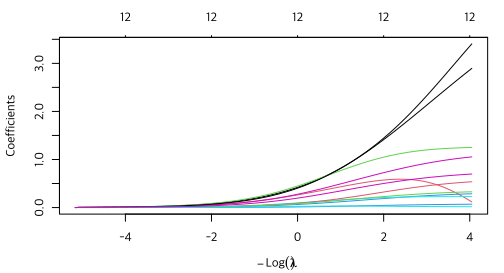
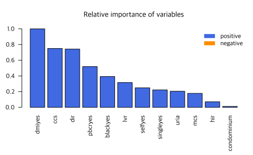
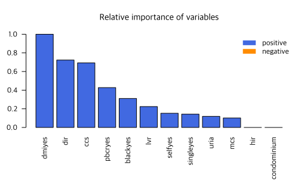
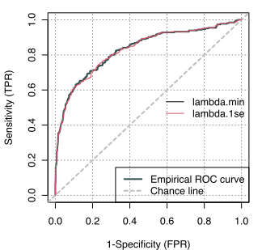

데이터는 <a href="20-data.md">여기</a>를 참조하거나 다음 명령 실행.

```R
rm(list=ls(all=TRUE))
load(url("https://github.com/chan079/loebook/raw/main/ml/2-Classification/data.RData"))
```

# Ridge와 Lasso

분류(classification) 문제에서도 [ridge]와 [lasso] 회귀를 할 수 있다.
회귀에서도 사용한 [glmnet] 패키지를 사용하고자 한다. 훈련은 불균형이
심한 원래 데이터 대신 random oversample한 데이터(`Over`)를 다음과 같이
만들어서 사용한다.

```R
set.seed(1)
idx1 <- which(TrainSet$deny=='no')
idx2 <- with(TrainSet, sample(which(deny=='yes'), sum(deny=='no'), replace=TRUE))
Over <- TrainSet[c(idx1,idx2), ]
summary(Over$deny)
#   no  yes
# 1948 1948
```

## 데이터 준비

앞에서는 `deny~.`과 같은 ‘formula’를 사용하였는데, `glmnet` 패키지를
이용하려면 feature들의 행렬(`X`)과 response의 벡터(`Y`)를 만들어
놓아야 한다. (`TrainSet`과 `TestSet` 데이터는 [데이터
준비](20-data.md) 단원에 만들었으니, 필요하면 방문해서 코드를
복사/붙여넣기로 실행한 후 계속하라.)

```R
fm <- deny~.
Y <- model.frame(fm, data=Over)[,1]
X <- model.matrix(fm, data=Over)[,-1]
dim(X)
# [1] 3896   12
```

추정 시에는 `Over`를 사용하고, train set에서 성능을 살펴볼 때에는
원래의 `TrainSet`을 이용할 것이다.

## Ridge regression

Lasso logit을 하자. 아래의 `glmnet` 명령에서 `family=binomial` 부분이
logit 회귀를 하도록 해 준다.

```R
library(glmnet)
ridge <- glmnet(X,Y,alpha=0,family=binomial)  # alpha=0 for ridge (1=lasso)
plot(ridge, xvar='lambda')
```



다음으로 10-fold [cross validation][CV] 방법으로 최적 $\lambda$를
정한다. 먼저 `cv.glmnet` 명령을 이용하여 CV를 하고 결과를 그림으로
그려 보자.

```R
set.seed(1)
cv.ridge <- cv.glmnet(X,Y, alpha=0, family=binomial)  # 0 = ridge, 1 = lasso, 10 folds
plot(cv.ridge)
```


그림에서 보듯이, CV 이탈도([deviance])를 최소화시키는 $\lambda$ 값이
`glmnet` 알고리즘이 자동으로 선발한 $\lambda$ 후보들 중 최솟값이다. 더
작은 값이 될 수 있도록 바꾸자(자세한 내용은 [regression
부분](../1-Regression/13-ridge-lasso.md) 참조).

```R
set.seed(1)
cv.ridge2 <- cv.glmnet(X,Y,alpha=0, family=binomial, lambda.min.ratio=1e-6, nlambda=200)
plot(cv.ridge2)
```


점선이 왼쪽 끝에 가까워서 마음에 들지 않지만 적어도 가장 작은 값은 아니므로
그냥 넘어가자.

다음은 `lambda.1se`를 사용한 test set 예측 결과이다.

```R
Performance(cv.ridge2, TestSet, s='lambda.1se')
# $ConfusionMatrix
#       pred
# actual  no yes
#    no  124  23
#    yes   8  12
# 
# $Summary
# Sensitivity Specificity   Precision    Accuracy
#   0.6000000   0.8435374   0.3428571   0.8143713
```

이 데이터의 경우 `lambda.1se` 대신 `lambda.min`을 사용하면 아래와
같이 negative의 올바른 예측이 1건 감소하고, 그에 따라 specificity가
근소하게 하락한다.

```R
Performance(cv.ridge2, TestSet, s='lambda.min')
# $ConfusionMatrix
#       pred
# actual  no yes
#    no  123  24
#    yes   8  12
# 
# $Summary
# Sensitivity Specificity   Precision    Accuracy
#   0.6000000   0.8367347   0.3333333   0.8083832
```

`lambda.1se`를 사용한 결과로 돌아와서, 계수들과 표준화 계수들은 다음과 같다.

```R
bhat.ridge <- coef(cv.ridge2, s = 'lambda.1se')
options(scipen=1)  # fixed digits (not exponential notation)
cbind(bhat.ridge, bhat.ridge * c(1, apply(X, 2, sd)))
# 13 x 2 sparse Matrix of class "dgCMatrix"
#              lambda.1se   lambda.1se
# (Intercept) -4.11408458 -4.114084583
# dir          2.99674558  0.524209620
# hir          0.31785056  0.050232787
# lvr          1.23868381  0.223238698
# ccs          0.27447891  0.529635631
# mcs          0.22744783  0.125908732
# pbcryes      1.01325197  0.366777455
# dmiyes       2.61322184  0.706249254
# selfyes      0.51059539  0.176037758
# singleyes    0.31679375  0.157260243
# uria         0.06645219  0.145023072
# condominium  0.01847096  0.008524631
# blackyes     0.67383126  0.277382153
```

위에서 첫 번째 칼럼은 계수, 두 번째 칼럼은 표준화 계수이다(상수항은
표준화하지 않았음). 단, `glmnet`은 표준화를 위해 표본분산을 구할 때
$n-1$로 나누는 것이 아니라 $n$으로 나누는 반면, R의 `sd` 명령은
$n-1$로 나눈 값에 제곱근을 취하므로, 위의 두 번째 열이 정확한
`glmnet`의 표준화 계수인 것은 아니나, 변수 간에 크기 비교만 할
것이므로 문제 없다. 계수 자체(변수의 측정단위에 따라 규모가 달라짐)가
아니라 표준화 계수값의 크기가 클수록 중요한 변수이다. `dmi` 변수의
중요도가 가장 높은 것으로 나왔으나 압도적인 중요성을 갖는 변수는 없다.

표준화 계수들의 상대적 크기(변수 중요도, 가장 중요한 변수의 중요도를
1.0으로 표준화)를 다음과 같이 그림으로 표현할 수 있다.

```R
plotVarimp <- function(bhat, X, horiz = FALSE) {
  bstd <- bhat[-1,]*apply(X,2,sd)  # standardize, drop intercept
  bstd <- bstd/max(abs(bstd))  # max=1.0
  bstd <- bstd[order(abs(bstd), decreasing = !horiz)]  # sort
  colors <- c('royalblue', 'darkorange')
  par(mar=if (horiz) c(5,6,4,1) else c(6.5,3,4,1), lend=1)  # need more space for variable names
  barplot(
      abs(bstd), names=names(bstd), col=colors[1+(bstd<0)], horiz=horiz,
      las=if (horiz) 1 else 2, main='Relative importance of variables'
  )
  legend(if (horiz) 'bottomright' else 'topright', c('positive','negative'), lty=1, lwd=8, col=colors, bty='n')
}
plotVarimp(bhat.ridge, X)  # try 'horiz = TRUE'
```



## Lasso

Lasso logit을 위해서는 `glmnet`과 `cv.glmnet`에서 `alpha`를 0에서 1로 바꾸면 된다.

```R
lasso <- glmnet(X,Y,family=binomial,alpha=1)
plot(lasso, xvar='lambda')
```


Lasso에 대하여 10-fold CV를 하면 결과는 다음과 같다.

```R
set.seed(1)
cv.lasso <- cv.glmnet(X,Y, family=binomial, alpha=1)  # 0 = ridge, 1 = lasso
plot(cv.lasso)
```


"1se" lasso 계수 추정치는 다음과 같다.

```R
bhat.lasso <- coef(cv.lasso, s = 'lambda.1se')
cbind(bhat.lasso, bhat.lasso * c(1, apply(X, 2, sd)))
# 13 x 2 sparse Matrix of class "dgCMatrix"
#              lambda.1se  lambda.1se
# (Intercept) -3.68318639 -3.68318639
# dir          3.31736931  0.58029514
# hir          .           .
# lvr          0.99790725  0.17984534
# ccs          0.28811176  0.55594163
# mcs          0.14755238  0.08168086
# pbcryes      0.94815115  0.34321223
# dmiyes       2.96989658  0.80264416
# selfyes      0.35453552  0.12223306
# singleyes    0.23073077  0.11453754
# uria         0.04377992  0.09554385
# condominium  .           .
# blackyes     0.60609562  0.24949882
```

변수중요도를 그림으로 그리면 다음과 같다.

```R
plotVarimp(bhat.lasso, X)
```




`lambda.1se`에 대응하는 결과를 테스트셋에 적용하여 `deny`를 예측하고
[confusion matrix]를 구하면 다음과 같다.

```R
Performance(cv.lasso, TestSet, s = 'lambda.1se')
# $ConfusionMatrix
#       pred
# actual  no yes
#    no  122  25
#    yes   8  12
# 
# $Summary
# Sensitivity Specificity   Precision    Accuracy
#   0.6000000   0.8299320   0.3243243   0.8023952
```

`lambda.min`를 이용하면 결과는 다음과 같다.

```R
Performance(cv.lasso, TestSet, s = 'lambda.min')
# $ConfusionMatrix
#       pred
# actual  no yes
#    no  123  24
#    yes   8  12
# 
# $Summary
# Sensitivity Specificity   Precision    Accuracy
#   0.6000000   0.8367347   0.3333333   0.8083832
```

`no`를 올바르게 예측하는 경우가 "1se"의 경우보다 1건 더 많다. 참고로,
train set에 적용할 때 "1se"를 이용하는 경우와 "min"을 이용하는 경우의
[ROC] 곡선은 다음과 같다.

```R
TrainX <- model.matrix(deny~., data=TrainSet)[,-1]
train.phat.lasso.min <- predict(cv.lasso, TrainX, type = 'r', s = 'lambda.min')
train.phat.lasso.1se <- predict(cv.lasso, TrainX, type = 'r', s = 'lambda.1se')
library(ROCit)
roc.train.lasso.min <- rocit(as.vector(train.phat.lasso.min), TrainSet$deny)
roc.train.lasso.1se <- rocit(as.vector(train.phat.lasso.1se), TrainSet$deny)
plot(roc.train.lasso.min, YIndex = FALSE)
with(roc.train.lasso.1se, lines(FPR, TPR, col=2))
legend('right', c('lambda.min', 'lambda.1se'), lty=1, col=1:2, bty='n')
```



거의 차이 없다.

Cutoff 조정과 관련해서는, 클래스를 균형화했으므로 필요성은 느끼지 않는다.

## Elastic Net

`glmnet`에서 $\alpha = 0$은 ridge, $\alpha=1$은 lasso이다. 일반적인
[elastic net]을 사용할 수도 있다. 결과는 별 차이가 없을 것이다. 예로
$\alpha=0.5$를 사용한 결과가 다음에 있다.

```R
cv.enet <- cv.glmnet(X,Y, family=binomial, alpha=0.5)
plot(cv.enet)
```


"1se" 기준을 사용한 결과를 test set에 적용하여 평가하면 다음과 같다.

```R
Performance(cv.enet, TestSet, s='lambda.1se')
# $ConfusionMatrix
#       pred
# actual  no yes
#    no  124  23
#    yes   7  13
# 
# $Summary
# Sensitivity Specificity   Precision    Accuracy
#   0.6500000   0.8435374   0.3611111   0.8203593
```

[CV]: https://en.wikipedia.org/wiki/Cross-validation_(statistics)
[confusion matrix]: https://en.wikipedia.org/wiki/Confusion_matrix
[ROC]: https://en.wikipedia.org/wiki/Receiver_operating_characteristic
[ridge]: https://en.wikipedia.org/wiki/Ridge_regression
[lasso]: https://en.wikipedia.org/wiki/Lasso_(statistics)
[glmnet]: https://cran.r-project.org/package=glmnet
[deviance]: https://en.wikipedia.org/wiki/Deviance_(statistics)
[elastic net]: https://en.wikipedia.org/wiki/Elastic_net_regularization
