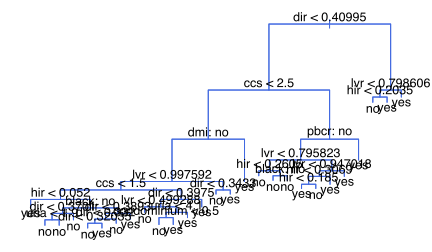
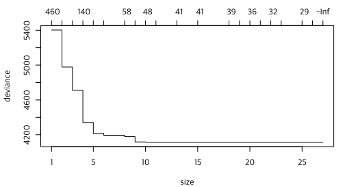
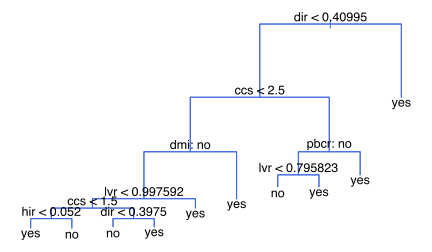
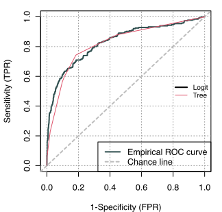
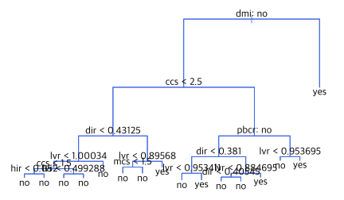
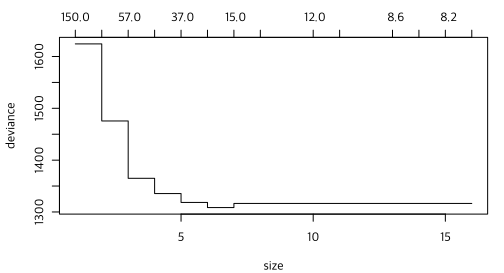
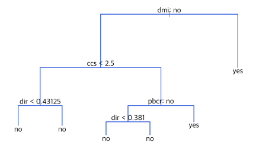
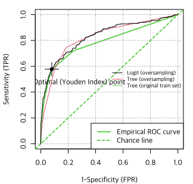

데이터는 <a href="20-data.md">여기</a>를 참조하거나 다음 명령 실행.

```R
rm(list=ls(all=TRUE))
load(url("https://github.com/chan079/loebook/raw/main/ml/2-Classification/data.RData"))
data(Hmda, package="Ecdat")
```

## Decision Tree

Decision [tree]를 실습해 보자. Decision tree는 각 구간(잎)마다 하나의
값만을 주므로 분류(classification)에 적절하다.  앞에서와 마찬가지로
다음과 같이 random over-sampling 기법으로 클래스 균형화를 하고
시작하자.

```R
set.seed(1)
idx1 <- which(TrainSet$deny=='no')
idx2 <- with(TrainSet, sample(which(deny=='yes'), sum(deny=='no'), replace=TRUE))
Over <- TrainSet[c(idx1,idx2), ]
summary(Over$deny)
#   no  yes 
# 1948 1948 
```

### 큰 나무

나무를 만들자. 우선 큰 나무를 만들어 본다. 아래 명령에서 `mindev=.005`
옵션(`mindev`의 디폴트 값은 0.01)은 잔 가지가 많은 나무를 만들도록 해
준다. `mindev` 값이 작을수록 나무를 크게 만든다.

```R
library(tree)
tr.full <- tree(deny~., data=Over, control=tree.control(nrow(Over), mindev=.005)) # large tree
plot(tr.full, col='royalblue')
text(tr.full, pretty = 0)
```



나뭇잎은 많다(27개).

### 가지치기

만들어진 나무(`tr.full`)를 그대로 사용하지 않고 CV를 통하여 가지치기를
해 주자. 이를 위해 우선 CV (10-fold)를 한다.

```R
set.seed(1)
cv.tr <- cv.tree(tr.full, FUN = prune.tree) # K = 10
plot(cv.tr)
```



그림을 보면 잎(말단 노드)이 10개일 때 `deviance`가 가장 작다. 잎 10개
나무를 최적 나무로 하자.

```R
tr.pruned <- prune.tree(tr.full, best=10)
plot(tr.pruned, col='royalblue')
text(tr.pruned, pretty = 0)
```



가지치기가 완료된 나무 그림을 보면 다음 변수들이 중요하다.

- `dir`: debt payments to total income ratio
- `ccs`: consumer credit score from 1 to 6 (low = good)
- `dmi`: denied mortgate insurance ?
- `pbcr`: public bad credit record ?
- `lvr`: ratio of size of loan to assessed value of property
- `hir`: housing expenses to income ratio

이 가지치기된 나무(`tr.pruned`)를 `TrainSet` 자료(`Over` 자료가
아니라)에 적용하여 예측하고, 성능을 살펴보자.  여기 써 먹으려고
[데이터 준비](20-data.md) 단원에서 `Performance()` 함수가 `tree`
객체를 처리할 수 있도록 이미 만들어 두었다.

```R
Performance(tr.pruned, TrainSet)
# $ConfusionMatrix
#       pred
# actual   no  yes
#    no  1589  359
#    yes   68  197
# 
# $Summary
# Sensitivity Specificity   Precision    Accuracy 
#   0.7433962   0.8157084   0.3543165   0.8070493 
```

[전체 변수를 사용한 로짓(`Over` 데이터 사용)](23-imbalance.md)과 [ROC] 곡선을 비교하자.

```R
logit.over <- glm(deny~., family = binomial, data = Over)
phat.logit <- predict(logit.over, TrainSet, type='r')
phat.ptree <- predict(tr.pruned, TrainSet)[,'yes']
library(ROCit)
roc.logit <- rocit(phat.logit, TrainSet$deny)
roc.ptree <- rocit(phat.ptree, TrainSet$deny)
plot(roc.logit, YIndex=F)
with(roc.ptree, lines(TPR~FPR, col=2))
legend('right', c('Logit', 'Tree'), lwd=c(2,1), col=1:2, cex=.8, bty='n')
```



몇 가지 점이 눈에 띈다. 첫째, 로짓과 나무의 결과가 약간 다르다.  둘째,
sensitivitiy와 specificity의 합의 최댓값은 나무의 경우가 더 크다.
셋째, 나무는 직선 여러 개를 합쳐 놓은 것처럼 보인다. 이는 나무가
'piecewise constant'이기 때문이다.  위의 가지치기한 나무는 잎이
10개여서 unique한 확률예측값은 10개뿐이다.

```R
table(phat.ptree)
# phat.ptree
# 0.171647509578544 0.323340471092077 0.333333333333333  0.65962441314554 
#              1113               338               206               184 
# 0.724137931034483 0.771428571428571 0.824039653035936 0.851063829787234 
#                22                11               226                11 
# 0.886904761904762 0.976377952755906 
#                82                20 
```

그리고 `roc.ptree`가 고려하는 cutoff 값도 10개뿐이다.

```R
roc.ptree$Cutoff
#  [1]       Inf 0.9763780 0.8869048 0.8510638 0.8240397 0.7714286 0.7241379
#  [8] 0.6596244 0.3333333 0.3233405 0.1716475
```

Cutoff가 0인 점은 좌하귀(0, 0)이고 cutoff가 1 (&geq;일 때 `yes`이므로
`1`이 아니라 `Inf`)인 점은 우상귀(1, 1)이다.

```R
with(roc.ptree, cbind(Cutoff, TPR, FPR))
#          Cutoff        TPR         FPR
#  [1,]       Inf 0.00000000 0.000000000
#  [2,] 0.9763780 0.06415094 0.001540041
#  [3,] 0.8869048 0.23018868 0.021047228
#  [4,] 0.8510638 0.24528302 0.024640657
#  [5,] 0.8240397 0.56226415 0.097535934
#  [6,] 0.7714286 0.57358491 0.101642710
#  [7,] 0.7241379 0.59622642 0.109856263
#  [8,] 0.6596244 0.74339623 0.184291581
#  [9,] 0.3333333 0.79622642 0.282854209
# [10,] 0.3233405 0.87924528 0.445071869
# [11,] 0.1716475 1.00000000 1.000000000
```

이 가지치기된 나무를 test set에 적용할 때의 performance는 다음과 같다.

```R
Performance(tr.pruned, TestSet)
# $ConfusionMatrix
#       pred
# actual  no yes
#    no  120  27
#    yes   8  12
# 
# $Summary
# Sensitivity Specificity   Precision    Accuracy 
#   0.6000000   0.8163265   0.3076923   0.7904192 
```

### Original train set 사용하고 cutoff 조정

Over-sample된 데이터가 아니라 원래 `TrainSet` 데이터를 사용하여 나무를
만들고 cutoff를 조정하는 방법을 사용해 보자.  원래 데이터에는 클래스
불균형이 현저함을 기억하라.

```R
summary(Over$deny) # random over-sampling
#   no  yes 
# 1948 1948 
summary(TrainSet$deny) # original train set
#   no  yes 
# 1948  265 
```

우선 큰 나무를 만들면 다음과 같다.

```R
library(tree)
tr.full.orig <- tree(deny~., data=TrainSet, control=tree.control(nrow(TrainSet), mindev=.005)) # large tree
plot(tr.full.orig, col='royalblue')
text(tr.full.orig, pretty = 0)
```



10-fold CV로 가지치기할 때의 deviance는 다음과 같다.

```R
set.seed(1)
cv.tr.orig <- cv.tree(tr.full.orig, FUN = prune.tree) # K = 10
plot(cv.tr.orig)
```



나무 크기가 6개일 때 최적화된다. 가지치기된 나무는 다음과 같다.

```R
tr.pruned.orig <- prune.tree(tr.full.orig, best = 6)
plot(tr.pruned.orig, col='royalblue')
text(tr.pruned.orig, pretty = 0)
```



나무 모양이 `Over` 자료를 사용할 때와 다르다.  이것으로 확률 0.5
기준으로 예측을 하면 train set에서 성능은 다음과 같다.  아마도
specificity는 높고 sensitivity는 낮을 것이다.

```R
Performance(tr.pruned.orig, TrainSet)
# $ConfusionMatrix
#       pred
# actual   no  yes
#    no  1897   51
#    yes  174   91
# 
# $Summary
# Sensitivity Specificity   Precision    Accuracy 
#   0.3433962   0.9738193   0.6408451   0.8983281 
```

예상한 대로 specificity는 높고 sensitivity는 낮다.  이는 0.5 임계값이
너무 높아서 좀처럼 `yes`로 예측을 하지 않기 때문이다. (그렇게 된
이유는 train set에 `no`가 대부분이어서 `yes`의 올바른 예측보다 `no`의
올바른 예측이 중요하기 때문이다.)

[Youden Index]를 최대화하는 cutoff 값을 구하자.

```R
phat.ptree.orig <- predict(tr.pruned.orig, TrainSet)[,'yes']
library(ROCit)
roc.ptree.orig <- rocit(phat.ptree.orig, TrainSet$deny)
(cutoff <- with(roc.ptree.orig, Cutoff[which.max(TPR-FPR)]))
# [1] 0.3291139
```

생각보다 값이 크다. 이 cutoff 값을 사용하여 예측하면 다음 결과를 얻는다.

```R
Performance(tr.pruned.orig, TrainSet, cutoff = cutoff)
# $ConfusionMatrix
#       pred
# actual   no  yes
#    no  1791  157
#    yes  112  153
# 
# $Summary
# Sensitivity Specificity   Precision    Accuracy 
#   0.5773585   0.9194045   0.4935484   0.8784455 
```

여전히 sensitivity가 낮다.  3개의 ROC를 그림으로 그려서 좀 더 살펴보자.

```R
plot(roc.ptree.orig, YIndex=T, col=3)
with(roc.ptree, lines(TPR~FPR, col=2))
with(roc.logit, lines(TPR~FPR, col=1))
legend('right', c('Logit (oversampling)', 'Tree (oversampling)', 'Tree (original train set)'), lty=1, col=1:3, bty='n', cex=.75)
```



그림에 "Optimal (Youden Index) point"로 표시된 것은 original train
set에 해당한다. 약간 왼쪽으로 치우친 느낌을 주는데, 이는 (우리
생각보다) cutoff가 높다는 것을 의미하고, 그로 인해서 sensitivity가
낮다.  이건 사람 눈으로 볼 때 그런 것이고, 아무튼 이를 test set에
적용하면 결과는 다음과 같다.

```R
Performance(tr.pruned.orig, TestSet, cutoff = cutoff)
# $ConfusionMatrix
#       pred
# actual  no yes
#    no  133  14
#    yes  11   9
# 
# $Summary
# Sensitivity Specificity   Precision    Accuracy 
#   0.4500000   0.9047619   0.3913043   0.8502994 
```

[tree]: https://en.wikipedia.org/wiki/Decision_tree_learning
[ROC]: https://en.wikipedia.org/wiki/Receiver_operating_characteristic
[Youden Index]: https://en.wikipedia.org/wiki/Youden%27s_J_statistic