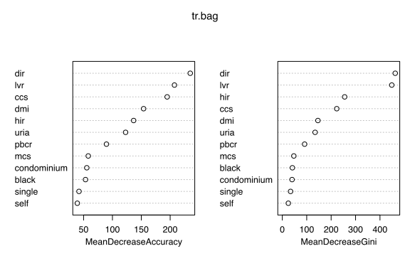
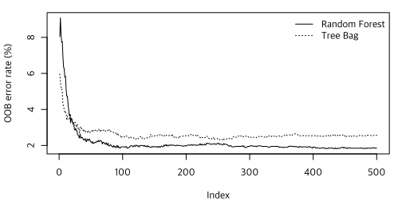
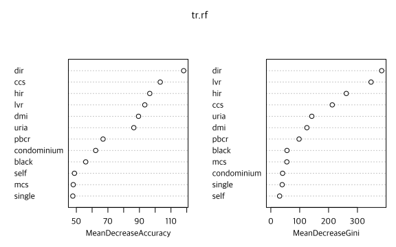
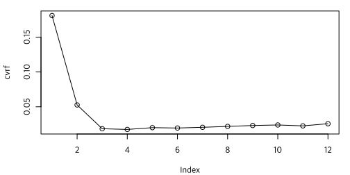
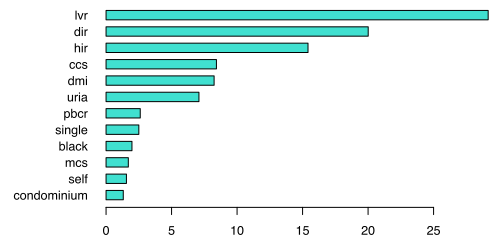

데이터는 <a href="20-data.md">여기</a>를 참조하거나 다음 명령 실행.

```R
rm(list=ls(all=TRUE))
load(url("https://github.com/chan079/loebook/raw/main/ml/2-Classification/data.RData"))
```

# Tree Ensemble

[Tree]와 관련된 [Bagging], [Random Forest], [Boosting] 방법을 실습해
본다. 클래스를 균형화한 데이터를 사용하여 학습한다.

```R
set.seed(1)
idx1 <- which(TrainSet$deny=='no')
idx2 <- with(TrainSet, sample(which(deny=='yes'), sum(deny=='no'), replace=TRUE))
Over <- TrainSet[c(idx1,idx2), ]
summary(Over$deny)
#   no  yes 
# 1948 1948
dim(Over)
# [1] 3896   13
```

## Bagging

부트스트랩 통합([bagging])은 [randomForest][randomForest-pkg] 패키지를
사용하여 구현할 수 있다.  특성변수가 12개이므로 `mtry`를 12로
설정한다(`mtry`가 12이면 bagging, 12보다 작으면 random forest이다).

```R
## Tree bag
library(randomForest)
set.seed(1)
tr.bag <- randomForest(deny~., data=Over, mtry=12, importance = TRUE)
tr.bag
# Call:
#  randomForest(formula = deny ~ ., data = Over, mtry = 12, importance = TRUE) 
#                Type of random forest: classification
#                      Number of trees: 500
# No. of variables tried at each split: 12
# 
#         OOB estimate of  error rate: 2.57%
# Confusion matrix:
#       no  yes class.error
# no  1848  100   0.0513347
# yes    0 1948   0.0000000
```

학습을 반복하면서 OOB error rate는 다음 추세를 보인다(학습곡선).
Bagging의 경우 학습곡선이 하향만 하지는 않는다(아래의 random forest도
마찬가지).

```R
plot(tr.bag$err.rate[, 'OOB']*100, type = 'l', ylab = 'OOB error rate (%)')
```


이 treebag의 최종적인 OOB error rate는 다음과 같이 약 2.57%이다(앞의
`randomForest` 명령 출력물에도 2.57% 값이 있다).

```R
with(tr.bag, err.rate[ntree])*100
# [1] 2.566735
```

변수 중요도는 다음과 같다.

```R
importance(tr.bag)
#                     no       yes MeanDecreaseAccuracy MeanDecreaseGini
# dir          70.009498 239.10945            243.53767        466.36737
# hir          30.290702 131.49855            132.19308        254.54803
# lvr          41.886611 225.51790            219.47576        450.93567
# ccs          29.450266 195.56403            191.91438        228.61239
# mcs          13.503171  56.30985             57.45655         48.57682
# pbcr         17.527058  96.49467             93.24064         87.57330
# dmi         120.967482 115.53249            152.05493        141.00700
# self          2.869898  38.77052             38.23997         23.27558
# single       10.355504  36.91207             36.43227         30.35715
# uria          3.723108 125.87359            120.83901        136.22865
# condominium  15.405659  55.23969             56.14083         41.22367
# black        26.275382  54.75447             59.81178         38.80233
```

`MeanDecreaseAccuracy`를 구하는 방법은 다음과 같다.  먼저 부트스트랩
시 제외되는 관측치들(OOB)을 가지고 예측 오차(분류 문제의 경우 잘못된
분류의 비율)를 측정하고, 한 변수씩 번갈아 뒤섞으면서 예측 오차가
얼마나 증가하는지 측정한다.  `MeanDecreaseAccuracy`는 부트스트랩
시마다 이 예측 오차 증가분을 측정하여 평균을 구한 것을 그 표준편차로
나눈 값이다(`randomForest` 명령에 `importance = TRUE` 옵션을 주면 예측
오류 증가분 평균과 표준편차를 리턴해 준다).

`MeanDecreaseGini`는 분할이 일어날 때 노드의 impurity가 감소하는
정도를 합한 것을 부트스트랩 나무들에 대하여 평균한 것이다.  "Gini"라는
이름이 붙는 이유는 분류 문제에서 노드의 impurity를 Gini 지수에 의해
측정하기 때문이다. Gini 지수란 클래스별 비율들의 제곱 합을 1에서 뺀
것이다.  예를 들어 60%가 `no`이고 40%가 `yes`이면 Gini 지수는 1 -
0.6^2 - 0.4^2 = 1 - 0.36 - 0.16 = 0.48이다.

변수 중요도를 그림으로 그리면 다음과 같다.

```R
varImpPlot(tr.bag)
```



Train set에서 성능을 살펴보자.  '[데이터 준비](20-data.md)' 단원에
만들어 놓은 `Performance()` 함수는 `randomForest` 객체도 처리하도록
만든 것이다.  Train set에서 위 tree bag의 성능은 다음과 같다.

```R
Performance(tr.bag, TrainSet)
# $ConfusionMatrix
#       pred
# actual   no  yes
#    no  1948    0
#    yes    0  265
# 
# $Summary
# Sensitivity Specificity   Precision    Accuracy 
#           1           1           1           1 
```

100% 깔끔하게 맞추었다.  참고로, over-sample된 훈련 데이터셋(`Over`)의
경우에도 100% 맞춘다.

```R
Performance(tr.bag, Over)
#       pred
# actual   no  yes
#    no  1948    0
#    yes    0 1948
# 
# $Summary
# Sensitivity Specificity   Precision    Accuracy 
#           1           1           1           1 
```

사실 over-sample되는 경우 원래 표본 내 관측치들이 반복하여 사용되는
것이므로 `Over`에서 다 맞추면 `TrainSet`에서도 다 맞추므로 당연한
일이다.

Test set은 어떤가?

```R
Performance(tr.bag, TestSet)
# $ConfusionMatrix
#       pred
# actual  no yes
#    no  134  13
#    yes  17   3
# 
# $Summary
# Sensitivity Specificity   Precision    Accuracy 
#   0.1500000   0.9115646   0.1875000   0.8203593 
```

Sensitivity가 매우 낮다(`yes`를 거의 맞추지 못한다).

## Random Forest

임의의 숲 분류(classification)에서 `mtry`는 보통 변수 개수의 제곱근을
사용한다.  `randomForest` 명령에 아무런 옵션도 주지 않으면 분류
문제에서 이 `mtry`를 사용한다.

```R
set.seed(1)
tr.rf <- randomForest(deny~., data=Over, importance = TRUE)
tr.rf
# Call:
#  randomForest(formula = deny ~ ., data = Over, importance = TRUE) 
#                Type of random forest: classification
#                      Number of trees: 500
# No. of variables tried at each split: 3
# 
#         OOB estimate of  error rate: 1.85%
# Confusion matrix:
#       no  yes class.error
# no  1882   66 0.033880903
# yes    6 1942 0.003080082
```

학습 진행 시 OOB error rate의 추이(학습곡선)는 다음 실선과 같다.
편의상 앞의 tree bag의 학습곡선도 점선으로 표시하였다.

```R
plot(tr.rf$err.rate[, 'OOB']*100, type = 'l', ylab = 'OOB error rate (%)')
lines(seq_len(tr.bag$ntree), tr.bag$err.rate[, 'OOB']*100, lty=3)
legend('topright', c('Random Forest', 'Tree Bag'), lty=c(1,3), bty='n')
```



Tree bag보다 Random Forest의 학습능력이 더 좋은 것을 알 수 있다.  이
Random Forest의 최종적인 OOB error rate는 다음과 같이 약 1.85%이다.

```R
with(tr.rf, err.rate[ntree])*100
# [1] 1.848049
```

변수 중요도는 다음과 같다.

```R
importance(tr.rf)
#                    no       yes MeanDecreaseAccuracy MeanDecreaseGini
# dir         53.887284 114.46744            118.05091        383.89810
# hir         23.562943  97.53333             96.54329        261.40395
# lvr         30.196077  94.99000             93.40887        347.16630
# ccs         28.958478 103.92847            103.18994        212.79364
# mcs          9.987928  48.01334             48.02229         55.51769
# pbcr        17.474750  68.08430             66.92709         97.88427
# dmi         71.852299  82.32836             89.41705        124.95443
# self         4.831283  50.46187             48.79179         30.46465
# single      14.646018  47.63157             47.75723         39.36441
# uria         3.241750  89.41002             86.44059        141.93225
# condominium 12.659502  62.60713             62.24955         40.73766
# black       14.692373  56.06460             55.93722         56.03262

varImpPlot(tr.rf)
```



Train set에서 성능을 살펴보면 다음과 같다.

```R
Performance(tr.rf, TrainSet)
# $ConfusionMatrix
#       pred
# actual   no  yes
#    no  1947    1
#    yes    0  265
# 
# $Summary
# Sensitivity Specificity   Precision    Accuracy 
#   1.0000000   0.9994867   0.9962406   0.9995481 
```

1건만 빼고 완벽히 맞추었다. 반면, test set에서 성능은 (sensitivity
측면에서) 그리 인상적이지 않다.

```R
Performance(tr.rf, TestSet)
# $ConfusionMatrix
#       pred
# actual  no yes
#    no  139   8
#    yes  13   7
# 
# $Summary
# Sensitivity Specificity   Precision    Accuracy 
#   0.3500000   0.9455782   0.4666667   0.8742515 
```

`mtry` 매개변수를 OOB 관측치들의 오차 측면에서 CV해 보자. `tr.rf`에는
`err.rate`가 포함되어 있는데 이것이 나무별로 OOB error rate를 갖고
있다. 전체 500개 나무 중 처음 3개 나무의 `err.rate`는 다음과 같다.

```R
head(tr.rf$err.rate, 3)
#             OOB        no        yes
# [1,] 0.08044383 0.1223629 0.03967168
# [2,] 0.09083082 0.1313742 0.05060034
# [3,] 0.08189357 0.1189488 0.04488950
```

`mtry`를 1~12까지 변화시키면서 평균 OOB error rate를 구해 보면 다음과
같다. 11번 해야 하므로 병렬처리를 하자.

```R
library(foreach)
library(doParallel)

## Prepare for parallel processing
(cores <- detectCores())  # machine-specific
# [1] 8
cl <- makeCluster(cores[1]-1, outfile="")
registerDoParallel(cl)

## Parallel processing
cvrf <- foreach(m = 1:12, .combine = c, .packages = 'randomForest') %dopar% {
  set.seed(1)
  rf <- randomForest(deny~., data = Over, mtry = m, importance = TRUE)
  cat(sprintf('OOB error rate for mtry %2d = %5.2f%%\n', m, with(rf, err.rate[ntree])*100))
  with(rf, err.rate[ntree])
}
# OOB error rate for mtry  1 = 18.10%
# OOB error rate for mtry  2 =  5.26%
# OOB error rate for mtry  3 =  1.85%
# OOB error rate for mtry  6 =  1.95%
# OOB error rate for mtry  4 =  1.75%
# OOB error rate for mtry  5 =  2.00%
# OOB error rate for mtry  7 =  2.05%
# OOB error rate for mtry  8 =  2.18%
# OOB error rate for mtry  9 =  2.31%
# OOB error rate for mtry 10 =  2.39%
# OOB error rate for mtry 11 =  2.26%
# OOB error rate for mtry 12 =  2.57%

## Clean up
stopCluster(cl)

cvrf
#  [1] 0.18095483 0.05261807 0.01848049 0.01745380 0.02002053 0.01950719
#  [7] 0.02053388 0.02181725 0.02310062 0.02387064 0.02258727 0.02566735

which.min(cvrf)
# [1] 4
plot(cvrf, type='o')
```



1~12 중 mtry = 4가 가장 최적이라는 결과를 얻었다.  참고로, 앞의
`tr.rf`에서 `mtry`는 3이 사용되었다.  `mtry`를 4로 설정한 임의의 숲을
학습하여 train set과 test set에 적용하면 다음 결과를 얻는다.

```R
tr.rf4 <- randomForest(deny~., data=Over, mtry = 4, importance = TRUE)
Performance(tr.rf4, TrainSet)
# $ConfusionMatrix
#       pred
# actual   no  yes
#    no  1948    0
#    yes    0  265
# 
# $Summary
# Sensitivity Specificity   Precision    Accuracy 
#           1           1           1           1 
Performance(tr.rf4, TestSet)
# $ConfusionMatrix
#       pred
# actual  no yes
#    no  139   8
#    yes  14   6
# 
# $Summary
# Sensitivity Specificity   Precision    Accuracy 
#   0.3000000   0.9455782   0.4285714   0.8682635 
```

결과는 대동소이하다.

## AdaBoosting

이 부분은 [Alfaro, Gámez, and García (2013, <i>Journal of Statistical Software</i>) 논문](https://www.jstatsoft.org/article/view/v054i02){target="_blank"}을
참조하였다.  패키지로 [adabag][adabag-pkg]을 사용한다.

```R
## Adaptive Boosting
library(adabag)
set.seed(1)
boost <- boosting(deny~., data=Over, boos=TRUE, mfinal = 50)
names(boost)
# [1] "formula"    "trees"      "weights"    "votes"      "prob"      
# [6] "class"      "importance" "terms"      "call"

opar <- par(mar=c(3,7,.1,1)+.1) # need more left margin for "condominium"
barplot(sort(boost$importance), las=1, horiz=TRUE, col='turquoise', space=.75)
par(opar) # back to default par(mar = c(5,4,4,2)+.1)
```



Performance는 다음과 같다.

```R
Performance(boost, TrainSet)
# $ConfusionMatrix
#       pred
# actual   no  yes
#    no  1866   82
#    yes    5  260
# 
# $Summary
# Sensitivity Specificity   Precision    Accuracy 
#   0.9811321   0.9579055   0.7602339   0.9606869 

Performance(boost, TestSet)
# $ConfusionMatrix
#       pred
# actual  no yes
#    no  130  17
#    yes  13   7
# 
# $Summary
# Sensitivity Specificity   Precision    Accuracy 
#   0.3500000   0.8843537   0.2916667   0.8203593 

## caret::confusionMatrix(factor(predict(boost, TestSet)$class), TestSet$deny, positive = 'yes')
```

Test Set의 경우, 앞서 `mtry=3`을 사용한 Random Forest에 비하여
Sensitivity는 약간 증가하고 Specificity는 현저하게 감소하였다.

[tree]: https://en.wikipedia.org/wiki/Decision_tree_learning
[bagging]: https://en.wikipedia.org/wiki/Bootstrap_aggregating
[random forest]: https://en.wikipedia.org/wiki/Random_forest
[boosting]: https://en.wikipedia.org/wiki/Boosting_%28machine_learning%29
[bagging]: https://en.wikipedia.org/wiki/Bootstrap_aggregating
[randomForest-pkg]: https://cran.r-project.org/package=randomForest
[adabag-pkg]: https://cran.r-project.org/package=adabag