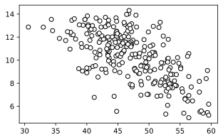

# 8장 다중회귀 모형과 그 추정

## 예제 8.1 음주율과 사망률


```python
%config InlineBackend.figure_formats = ['svg']
```


```python
import pandas as pd
import statsmodels.formula.api as smf

Death = pd.read_csv('csv/loedata/Death.csv')
ols = smf.ols('deathrate~drink', data=Death[Death.year==2010]).fit()
ols.summary()
```


<table class="simpletable">
<caption>OLS Regression Results</caption>
<tr>
  <th>Dep. Variable:</th>        <td>deathrate</td>    <th>  R-squared:         </th> <td>   0.318</td>
</tr>
<tr>
  <th>Model:</th>                   <td>OLS</td>       <th>  Adj. R-squared:    </th> <td>   0.310</td>
</tr>
<tr>
  <th>Method:</th>             <td>Least Squares</td>  <th>  F-statistic:       </th> <td>   39.14</td>
</tr>
<tr>
  <th>Date:</th>             <td>Wed, 11 Feb 2026</td> <th>  Prob (F-statistic):</th> <td>1.59e-08</td>
</tr>
<tr>
  <th>Time:</th>                 <td>11:08:11</td>     <th>  Log-Likelihood:    </th> <td> -173.59</td>
</tr>
<tr>
  <th>No. Observations:</th>      <td>    86</td>      <th>  AIC:               </th> <td>   351.2</td>
</tr>
<tr>
  <th>Df Residuals:</th>          <td>    84</td>      <th>  BIC:               </th> <td>   356.1</td>
</tr>
<tr>
  <th>Df Model:</th>              <td>     1</td>      <th>                     </th>     <td> </td>   
</tr>
<tr>
  <th>Covariance Type:</th>      <td>nonrobust</td>    <th>                     </th>     <td> </td>   
</tr>
</table>
<table class="simpletable">
<tr>
      <td></td>         <th>coef</th>     <th>std err</th>      <th>t</th>      <th>P>|t|</th>  <th>[0.025</th>    <th>0.975]</th>  
</tr>
<tr>
  <th>Intercept</th> <td>   21.1006</td> <td>    1.722</td> <td>   12.252</td> <td> 0.000</td> <td>   17.676</td> <td>   24.525</td>
</tr>
<tr>
  <th>drink</th>     <td>   -0.2268</td> <td>    0.036</td> <td>   -6.256</td> <td> 0.000</td> <td>   -0.299</td> <td>   -0.155</td>
</tr>
</table>
<table class="simpletable">
<tr>
  <th>Omnibus:</th>       <td> 0.580</td> <th>  Durbin-Watson:     </th> <td>   1.435</td>
</tr>
<tr>
  <th>Prob(Omnibus):</th> <td> 0.748</td> <th>  Jarque-Bera (JB):  </th> <td>   0.574</td>
</tr>
<tr>
  <th>Skew:</th>          <td>-0.188</td> <th>  Prob(JB):          </th> <td>   0.750</td>
</tr>
<tr>
  <th>Kurtosis:</th>      <td> 2.865</td> <th>  Cond. No.          </th> <td>    412.</td>
</tr>
</table><br/><br/>Notes:<br/>[1] Standard Errors assume that the covariance matrix of the errors is correctly specified.


```python
import matplotlib.pyplot as plt
plt.figure(figsize=(5,3))
plt.scatter(Death.drink, Death.deathrate, facecolors='w', edgecolors='k')
plt.show()
```


    

    


## 예제 8.2 음주율과 사망률(계속)


```python
smf.ols('deathrate~drink+aged', data=Death[Death.year==2010]).fit().summary()
```


<table class="simpletable">
<caption>OLS Regression Results</caption>
<tr>
  <th>Dep. Variable:</th>        <td>deathrate</td>    <th>  R-squared:         </th> <td>   0.919</td>
</tr>
<tr>
  <th>Model:</th>                   <td>OLS</td>       <th>  Adj. R-squared:    </th> <td>   0.917</td>
</tr>
<tr>
  <th>Method:</th>             <td>Least Squares</td>  <th>  F-statistic:       </th> <td>   470.0</td>
</tr>
<tr>
  <th>Date:</th>             <td>Wed, 11 Feb 2026</td> <th>  Prob (F-statistic):</th> <td>5.38e-46</td>
</tr>
<tr>
  <th>Time:</th>                 <td>11:08:12</td>     <th>  Log-Likelihood:    </th> <td> -82.034</td>
</tr>
<tr>
  <th>No. Observations:</th>      <td>    86</td>      <th>  AIC:               </th> <td>   170.1</td>
</tr>
<tr>
  <th>Df Residuals:</th>          <td>    83</td>      <th>  BIC:               </th> <td>   177.4</td>
</tr>
<tr>
  <th>Df Model:</th>              <td>     2</td>      <th>                     </th>     <td> </td>   
</tr>
<tr>
  <th>Covariance Type:</th>      <td>nonrobust</td>    <th>                     </th>     <td> </td>   
</tr>
</table>
<table class="simpletable">
<tr>
      <td></td>         <th>coef</th>     <th>std err</th>      <th>t</th>      <th>P>|t|</th>  <th>[0.025</th>    <th>0.975]</th>  
</tr>
<tr>
  <th>Intercept</th> <td>   -0.6139</td> <td>    1.060</td> <td>   -0.579</td> <td> 0.564</td> <td>   -2.722</td> <td>    1.495</td>
</tr>
<tr>
  <th>drink</th>     <td>    0.0344</td> <td>    0.016</td> <td>    2.099</td> <td> 0.039</td> <td>    0.002</td> <td>    0.067</td>
</tr>
<tr>
  <th>aged</th>      <td>    0.4058</td> <td>    0.016</td> <td>   24.797</td> <td> 0.000</td> <td>    0.373</td> <td>    0.438</td>
</tr>
</table>
<table class="simpletable">
<tr>
  <th>Omnibus:</th>       <td> 0.091</td> <th>  Durbin-Watson:     </th> <td>   2.150</td>
</tr>
<tr>
  <th>Prob(Omnibus):</th> <td> 0.955</td> <th>  Jarque-Bera (JB):  </th> <td>   0.086</td>
</tr>
<tr>
  <th>Skew:</th>          <td>-0.064</td> <th>  Prob(JB):          </th> <td>   0.958</td>
</tr>
<tr>
  <th>Kurtosis:</th>      <td> 2.912</td> <th>  Cond. No.          </th> <td>    810.</td>
</tr>
</table><br/><br/>Notes:<br/>[1] Standard Errors assume that the covariance matrix of the errors is correctly specified.


## 예제 8.3 여성 더미, 남성 더미, 공선성


```python
import pandas as pd
import numpy as np

Wages1 = pd.read_csv('csv/Ecdat/Wages1.csv')
## https://stackoverflow.com/questions/20840803/how-to-convert-false-to-0-and-true-to-1
Wages1['male'] = [int(x) for x in Wages1.sex=='male'] # :-(
Wages1['female'] = [int(x) for x in Wages1.sex=='female'] # :-(
Wages1.head()
```


<div>
<style scoped>
    .dataframe tbody tr th:only-of-type {
        vertical-align: middle;
    }

    .dataframe tbody tr th {
        vertical-align: top;
    }

    .dataframe thead th {
        text-align: right;
    }
</style>
<table border="1" class="dataframe">
  <thead>
    <tr style="text-align: right;">
      <th></th>
      <th>exper</th>
      <th>sex</th>
      <th>school</th>
      <th>wage</th>
      <th>male</th>
      <th>female</th>
    </tr>
  </thead>
  <tbody>
    <tr>
      <th>0</th>
      <td>9</td>
      <td>female</td>
      <td>13</td>
      <td>6.315296</td>
      <td>0</td>
      <td>1</td>
    </tr>
    <tr>
      <th>1</th>
      <td>12</td>
      <td>female</td>
      <td>12</td>
      <td>5.479770</td>
      <td>0</td>
      <td>1</td>
    </tr>
    <tr>
      <th>2</th>
      <td>11</td>
      <td>female</td>
      <td>11</td>
      <td>3.642170</td>
      <td>0</td>
      <td>1</td>
    </tr>
    <tr>
      <th>3</th>
      <td>9</td>
      <td>female</td>
      <td>14</td>
      <td>4.593337</td>
      <td>0</td>
      <td>1</td>
    </tr>
    <tr>
      <th>4</th>
      <td>8</td>
      <td>female</td>
      <td>14</td>
      <td>2.418157</td>
      <td>0</td>
      <td>1</td>
    </tr>
  </tbody>
</table>
</div>


```python
np.sum(Wages1.male), np.sum(Wages1.female)
```


    (1725, 1569)


대상을 여성으로 한정하면 `female` 더미변수는 상수항과 완전한 공선성을 갖는다. 그럼에도 파이썬은 (실수 연산의 불가피한 부정확성으로 인하여) 여전히 값을 계산한다. [Stack overflow의 이 글](https://stackoverflow.com/questions/74474611/statsmodels-ols-gives-parameters-despite-perfect-multicollinearity)에 이유가 있다. 이렇게 처리하는 것은 예측 시에는 큰 문제가 없을 수도 있으나 **인과관계 분석에서는 용납되지 않는다**. R은 공선성을 체크하여 공선성이 있다고 판단되면 해당 변수에 `NA`를 리포트한다.


```python
import statsmodels.formula.api as smf
ols = smf.ols('wage~female', data=Wages1[Wages1.female==1]).fit()
print(ols.params)
```

    Intercept    8.384840e+12
    female      -8.384840e+12
    dtype: float64


위 결과를 보고 절편과 `female` 더미변수의 계수가 &pm;8,384,400,000,000처럼 터무니없이 큰 값이라고 생각해서는 안 된다. 파이썬의 `statsmodels` 모듈이 그런 식으로 공선성을 잘못 처리하도록 코딩되었나보다 생각하면 된다. 공선성에 관한 한 `statsmodels`는 믿을 수 없다. 참고로, summary는 더 많은 정보를 담고 있다.


```python
ols.summary()
```


<table class="simpletable">
<caption>OLS Regression Results</caption>
<tr>
  <th>Dep. Variable:</th>          <td>wage</td>       <th>  R-squared:         </th> <td>  -0.001</td>
</tr>
<tr>
  <th>Model:</th>                   <td>OLS</td>       <th>  Adj. R-squared:    </th> <td>  -0.001</td>
</tr>
<tr>
  <th>Method:</th>             <td>Least Squares</td>  <th>  F-statistic:       </th> <td> -0.8714</td>
</tr>
<tr>
  <th>Date:</th>             <td>Wed, 11 Feb 2026</td> <th>  Prob (F-statistic):</th>  <td>  1.00</td> 
</tr>
<tr>
  <th>Time:</th>                 <td>11:08:12</td>     <th>  Log-Likelihood:    </th> <td> -3883.9</td>
</tr>
<tr>
  <th>No. Observations:</th>      <td>  1569</td>      <th>  AIC:               </th> <td>   7772.</td>
</tr>
<tr>
  <th>Df Residuals:</th>          <td>  1567</td>      <th>  BIC:               </th> <td>   7782.</td>
</tr>
<tr>
  <th>Df Model:</th>              <td>     1</td>      <th>                     </th>     <td> </td>   
</tr>
<tr>
  <th>Covariance Type:</th>      <td>nonrobust</td>    <th>                     </th>     <td> </td>   
</tr>
</table>
<table class="simpletable">
<tr>
      <td></td>         <th>coef</th>     <th>std err</th>      <th>t</th>      <th>P>|t|</th>  <th>[0.025</th>    <th>0.975]</th>  
</tr>
<tr>
  <th>Intercept</th> <td> 8.385e+12</td> <td> 2.06e+13</td> <td>    0.406</td> <td> 0.685</td> <td>-3.21e+13</td> <td> 4.89e+13</td>
</tr>
<tr>
  <th>female</th>    <td>-8.385e+12</td> <td> 2.06e+13</td> <td>   -0.406</td> <td> 0.685</td> <td>-4.89e+13</td> <td> 3.21e+13</td>
</tr>
</table>
<table class="simpletable">
<tr>
  <th>Omnibus:</th>       <td>762.482</td> <th>  Durbin-Watson:     </th> <td>   1.872</td>
</tr>
<tr>
  <th>Prob(Omnibus):</th> <td> 0.000</td>  <th>  Jarque-Bera (JB):  </th> <td>8859.515</td>
</tr>
<tr>
  <th>Skew:</th>          <td> 1.975</td>  <th>  Prob(JB):          </th> <td>    0.00</td>
</tr>
<tr>
  <th>Kurtosis:</th>      <td>13.951</td>  <th>  Cond. No.          </th> <td>5.68e+14</td>
</tr>
</table><br/><br/>Notes:<br/>[1] Standard Errors assume that the covariance matrix of the errors is correctly specified.<br/>[2] The smallest eigenvalue is 9.71e-27. This might indicate that there are<br/>strong multicollinearity problems or that the design matrix is singular.


위 Notes \[2\]에 강한 다중상관 또는 특이성이 존재한다는 말이 있다.

다음은 공선성 문제가 없는 결과이다.


```python
smf.ols('wage~female', data=Wages1).fit().summary()
```


<table class="simpletable">
<caption>OLS Regression Results</caption>
<tr>
  <th>Dep. Variable:</th>          <td>wage</td>       <th>  R-squared:         </th> <td>   0.032</td> 
</tr>
<tr>
  <th>Model:</th>                   <td>OLS</td>       <th>  Adj. R-squared:    </th> <td>   0.031</td> 
</tr>
<tr>
  <th>Method:</th>             <td>Least Squares</td>  <th>  F-statistic:       </th> <td>   107.9</td> 
</tr>
<tr>
  <th>Date:</th>             <td>Wed, 11 Feb 2026</td> <th>  Prob (F-statistic):</th> <td>6.71e-25</td> 
</tr>
<tr>
  <th>Time:</th>                 <td>11:08:12</td>     <th>  Log-Likelihood:    </th> <td> -8522.2</td> 
</tr>
<tr>
  <th>No. Observations:</th>      <td>  3294</td>      <th>  AIC:               </th> <td>1.705e+04</td>
</tr>
<tr>
  <th>Df Residuals:</th>          <td>  3292</td>      <th>  BIC:               </th> <td>1.706e+04</td>
</tr>
<tr>
  <th>Df Model:</th>              <td>     1</td>      <th>                     </th>     <td> </td>    
</tr>
<tr>
  <th>Covariance Type:</th>      <td>nonrobust</td>    <th>                     </th>     <td> </td>    
</tr>
</table>
<table class="simpletable">
<tr>
      <td></td>         <th>coef</th>     <th>std err</th>      <th>t</th>      <th>P>|t|</th>  <th>[0.025</th>    <th>0.975]</th>  
</tr>
<tr>
  <th>Intercept</th> <td>    6.3130</td> <td>    0.077</td> <td>   81.495</td> <td> 0.000</td> <td>    6.161</td> <td>    6.465</td>
</tr>
<tr>
  <th>female</th>    <td>   -1.1661</td> <td>    0.112</td> <td>  -10.389</td> <td> 0.000</td> <td>   -1.386</td> <td>   -0.946</td>
</tr>
</table>
<table class="simpletable">
<tr>
  <th>Omnibus:</th>       <td>1538.963</td> <th>  Durbin-Watson:     </th> <td>   1.866</td> 
</tr>
<tr>
  <th>Prob(Omnibus):</th>  <td> 0.000</td>  <th>  Jarque-Bera (JB):  </th> <td>15569.712</td>
</tr>
<tr>
  <th>Skew:</th>           <td> 1.965</td>  <th>  Prob(JB):          </th> <td>    0.00</td> 
</tr>
<tr>
  <th>Kurtosis:</th>       <td>12.899</td>  <th>  Cond. No.          </th> <td>    2.57</td> 
</tr>
</table><br/><br/>Notes:<br/>[1] Standard Errors assume that the covariance matrix of the errors is correctly specified.


다음은 남성 더미와 여성 더미를 모두 포함시켰고 절편도 있으므로 완전한 공선성이 있다.


```python
smf.ols('wage~male+female', data=Wages1).fit().summary()
```


<table class="simpletable">
<caption>OLS Regression Results</caption>
<tr>
  <th>Dep. Variable:</th>          <td>wage</td>       <th>  R-squared:         </th> <td>   0.032</td> 
</tr>
<tr>
  <th>Model:</th>                   <td>OLS</td>       <th>  Adj. R-squared:    </th> <td>   0.031</td> 
</tr>
<tr>
  <th>Method:</th>             <td>Least Squares</td>  <th>  F-statistic:       </th> <td>   53.94</td> 
</tr>
<tr>
  <th>Date:</th>             <td>Wed, 11 Feb 2026</td> <th>  Prob (F-statistic):</th> <td>8.90e-24</td> 
</tr>
<tr>
  <th>Time:</th>                 <td>11:08:12</td>     <th>  Log-Likelihood:    </th> <td> -8522.2</td> 
</tr>
<tr>
  <th>No. Observations:</th>      <td>  3294</td>      <th>  AIC:               </th> <td>1.705e+04</td>
</tr>
<tr>
  <th>Df Residuals:</th>          <td>  3291</td>      <th>  BIC:               </th> <td>1.707e+04</td>
</tr>
<tr>
  <th>Df Model:</th>              <td>     2</td>      <th>                     </th>     <td> </td>    
</tr>
<tr>
  <th>Covariance Type:</th>      <td>nonrobust</td>    <th>                     </th>     <td> </td>    
</tr>
</table>
<table class="simpletable">
<tr>
      <td></td>         <th>coef</th>     <th>std err</th>      <th>t</th>      <th>P>|t|</th>  <th>[0.025</th>    <th>0.975]</th>  
</tr>
<tr>
  <th>Intercept</th> <td> 2.441e+11</td> <td> 2.35e+12</td> <td>    0.104</td> <td> 0.917</td> <td>-4.37e+12</td> <td> 4.85e+12</td>
</tr>
<tr>
  <th>male</th>      <td>-2.441e+11</td> <td> 2.35e+12</td> <td>   -0.104</td> <td> 0.917</td> <td>-4.85e+12</td> <td> 4.37e+12</td>
</tr>
<tr>
  <th>female</th>    <td>-2.441e+11</td> <td> 2.35e+12</td> <td>   -0.104</td> <td> 0.917</td> <td>-4.85e+12</td> <td> 4.37e+12</td>
</tr>
</table>
<table class="simpletable">
<tr>
  <th>Omnibus:</th>       <td>1538.658</td> <th>  Durbin-Watson:     </th> <td>   1.866</td> 
</tr>
<tr>
  <th>Prob(Omnibus):</th>  <td> 0.000</td>  <th>  Jarque-Bera (JB):  </th> <td>15564.272</td>
</tr>
<tr>
  <th>Skew:</th>           <td> 1.965</td>  <th>  Prob(JB):          </th> <td>    0.00</td> 
</tr>
<tr>
  <th>Kurtosis:</th>       <td>12.898</td>  <th>  Cond. No.          </th> <td>8.90e+13</td> 
</tr>
</table><br/><br/>Notes:<br/>[1] Standard Errors assume that the covariance matrix of the errors is correctly specified.<br/>[2] The smallest eigenvalue is 6.24e-25. This might indicate that there are<br/>strong multicollinearity problems or that the design matrix is singular.


여기도 마찬가지이다. 파이썬 `statsmodels` 모듈은 다중공선성 문제에 대한 판단을 사람에게 맡긴다. 인과관계 분석에서는 **매우 조심해야 한다**.

남성 더미변수와 여성 더미변수가 있더라도 절편이 없으면 공선성 문제는 발생하지 않는다.


```python
smf.ols('wage~male+female-1', data=Wages1).fit().summary()
```


<table class="simpletable">
<caption>OLS Regression Results</caption>
<tr>
  <th>Dep. Variable:</th>          <td>wage</td>       <th>  R-squared:         </th> <td>   0.032</td> 
</tr>
<tr>
  <th>Model:</th>                   <td>OLS</td>       <th>  Adj. R-squared:    </th> <td>   0.031</td> 
</tr>
<tr>
  <th>Method:</th>             <td>Least Squares</td>  <th>  F-statistic:       </th> <td>   107.9</td> 
</tr>
<tr>
  <th>Date:</th>             <td>Wed, 11 Feb 2026</td> <th>  Prob (F-statistic):</th> <td>6.71e-25</td> 
</tr>
<tr>
  <th>Time:</th>                 <td>11:08:12</td>     <th>  Log-Likelihood:    </th> <td> -8522.2</td> 
</tr>
<tr>
  <th>No. Observations:</th>      <td>  3294</td>      <th>  AIC:               </th> <td>1.705e+04</td>
</tr>
<tr>
  <th>Df Residuals:</th>          <td>  3292</td>      <th>  BIC:               </th> <td>1.706e+04</td>
</tr>
<tr>
  <th>Df Model:</th>              <td>     1</td>      <th>                     </th>     <td> </td>    
</tr>
<tr>
  <th>Covariance Type:</th>      <td>nonrobust</td>    <th>                     </th>     <td> </td>    
</tr>
</table>
<table class="simpletable">
<tr>
     <td></td>       <th>coef</th>     <th>std err</th>      <th>t</th>      <th>P>|t|</th>  <th>[0.025</th>    <th>0.975]</th>  
</tr>
<tr>
  <th>male</th>   <td>    6.3130</td> <td>    0.077</td> <td>   81.495</td> <td> 0.000</td> <td>    6.161</td> <td>    6.465</td>
</tr>
<tr>
  <th>female</th> <td>    5.1469</td> <td>    0.081</td> <td>   63.366</td> <td> 0.000</td> <td>    4.988</td> <td>    5.306</td>
</tr>
</table>
<table class="simpletable">
<tr>
  <th>Omnibus:</th>       <td>1538.963</td> <th>  Durbin-Watson:     </th> <td>   1.866</td> 
</tr>
<tr>
  <th>Prob(Omnibus):</th>  <td> 0.000</td>  <th>  Jarque-Bera (JB):  </th> <td>15569.712</td>
</tr>
<tr>
  <th>Skew:</th>           <td> 1.965</td>  <th>  Prob(JB):          </th> <td>    0.00</td> 
</tr>
<tr>
  <th>Kurtosis:</th>       <td>12.899</td>  <th>  Cond. No.          </th> <td>    1.05</td> 
</tr>
</table><br/><br/>Notes:<br/>[1] Standard Errors assume that the covariance matrix of the errors is correctly specified.


## 맞춘값, 잔차, 제곱합, R제곱


```python
import pandas as pd
import numpy as np
import statsmodels.formula.api as smf

Wages1 = pd.read_csv('csv/Ecdat/Wages1.csv')
smf.ols('np.log(wage)~sex+school+exper', data=Wages1).fit().summary()
```


<table class="simpletable">
<caption>OLS Regression Results</caption>
<tr>
  <th>Dep. Variable:</th>      <td>np.log(wage)</td>   <th>  R-squared:         </th> <td>   0.137</td> 
</tr>
<tr>
  <th>Model:</th>                   <td>OLS</td>       <th>  Adj. R-squared:    </th> <td>   0.137</td> 
</tr>
<tr>
  <th>Method:</th>             <td>Least Squares</td>  <th>  F-statistic:       </th> <td>   174.7</td> 
</tr>
<tr>
  <th>Date:</th>             <td>Wed, 11 Feb 2026</td> <th>  Prob (F-statistic):</th> <td>4.04e-105</td>
</tr>
<tr>
  <th>Time:</th>                 <td>11:08:12</td>     <th>  Log-Likelihood:    </th> <td> -2869.8</td> 
</tr>
<tr>
  <th>No. Observations:</th>      <td>  3294</td>      <th>  AIC:               </th> <td>   5748.</td> 
</tr>
<tr>
  <th>Df Residuals:</th>          <td>  3290</td>      <th>  BIC:               </th> <td>   5772.</td> 
</tr>
<tr>
  <th>Df Model:</th>              <td>     3</td>      <th>                     </th>     <td> </td>    
</tr>
<tr>
  <th>Covariance Type:</th>      <td>nonrobust</td>    <th>                     </th>     <td> </td>    
</tr>
</table>
<table class="simpletable">
<tr>
       <td></td>          <th>coef</th>     <th>std err</th>      <th>t</th>      <th>P>|t|</th>  <th>[0.025</th>    <th>0.975]</th>  
</tr>
<tr>
  <th>Intercept</th>   <td>   -0.2593</td> <td>    0.088</td> <td>   -2.936</td> <td> 0.003</td> <td>   -0.433</td> <td>   -0.086</td>
</tr>
<tr>
  <th>sex[T.male]</th> <td>    0.2426</td> <td>    0.020</td> <td>   11.860</td> <td> 0.000</td> <td>    0.202</td> <td>    0.283</td>
</tr>
<tr>
  <th>school</th>      <td>    0.1234</td> <td>    0.006</td> <td>   19.802</td> <td> 0.000</td> <td>    0.111</td> <td>    0.136</td>
</tr>
<tr>
  <th>exper</th>       <td>    0.0354</td> <td>    0.005</td> <td>    7.845</td> <td> 0.000</td> <td>    0.027</td> <td>    0.044</td>
</tr>
</table>
<table class="simpletable">
<tr>
  <th>Omnibus:</th>       <td>881.201</td> <th>  Durbin-Watson:     </th> <td>   1.875</td>
</tr>
<tr>
  <th>Prob(Omnibus):</th> <td> 0.000</td>  <th>  Jarque-Bera (JB):  </th> <td>3779.073</td>
</tr>
<tr>
  <th>Skew:</th>          <td>-1.239</td>  <th>  Prob(JB):          </th> <td>    0.00</td>
</tr>
<tr>
  <th>Kurtosis:</th>      <td> 7.625</td>  <th>  Cond. No.          </th> <td>    126.</td>
</tr>
</table><br/><br/>Notes:<br/>[1] Standard Errors assume that the covariance matrix of the errors is correctly specified.


R-squared는 다음과 같이 얻는다.


```python
np.random.seed(1)
Wages1['rnd'] = np.random.normal(size=len(Wages1))
## https://www.statsmodels.org/0.6.1/examples/notebooks/generated/ols.html
smf.ols('np.log(wage)~sex+school+exper', data=Wages1).fit().rsquared
```


    0.13743765266234365


어떤 변수든 설명변수로 포함시키기만 하면 R-squared는 증가한다.


```python
smf.ols('np.log(wage)~sex+school+exper+rnd', data=Wages1).fit().rsquared
```


    0.1374480389013667


